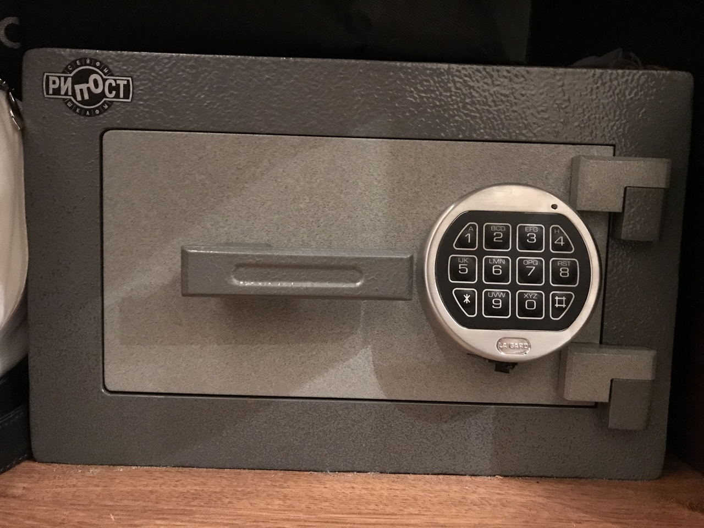
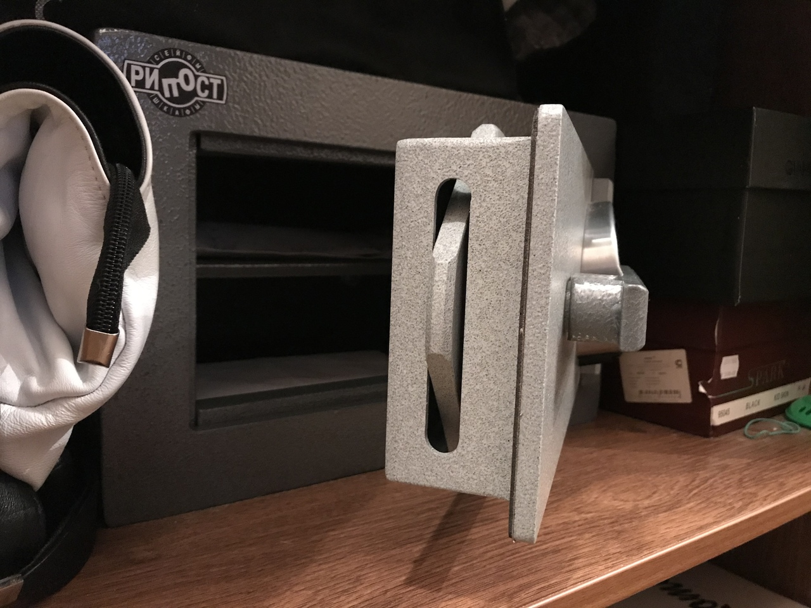

# Сейфовый замок не реагировал на ввод кода и выдавал ошибку.

Произвели аккуратное вскрытие замка сейфа и установили новый код! 

Причин невозможности открыть домашний или офисный сейф бывает множество, от элементарной забывчивости кода (пароля), до заклинивания системы запирания. Но несомненно одно: если вы хотите его открыть, значит, содержимое сейфа вам требуется незамедлительно.

Мы гарантируем, что сможем выслать мастера по указанному вами адресу незамедлительно, при этом стоимость аварийного вскрытия сейфов не сильно отличается от обычной цены и зависит в основном от самого сейфа и его замкового механизма.

Вскрыть сейф быстро получается не всегда, но что касается аккуратности – здесь наши высококвалифицированные специалисты вне конкуренции. Ответственность, понимание проблем клиента, наличие огромного опыта и специального инструмента – вот залог успеха наших мастеров. Мы работает настолько ювелирно, что неповрежденным остается не только сам сейф, но и его содержимое, даже если оно хрупкое.