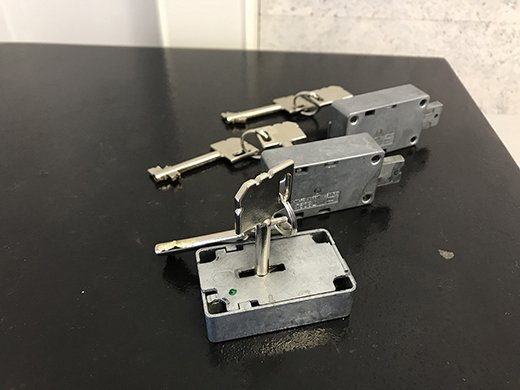
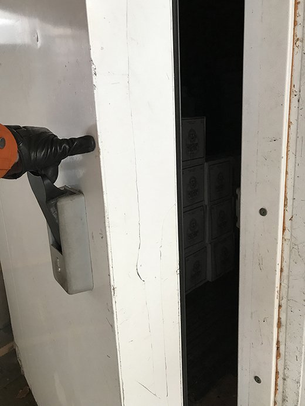
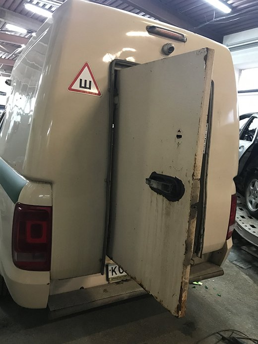
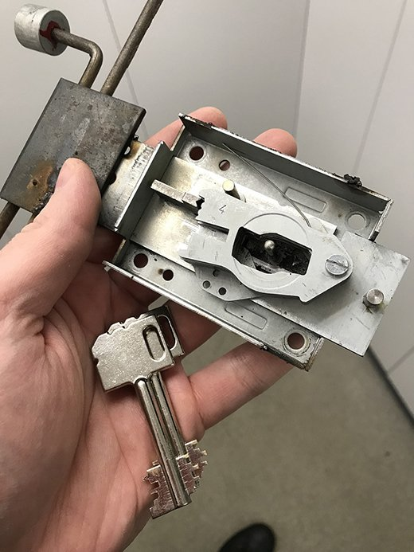

Добро пожаловать в блог нашей компании

Мы давно ведём бизнес по вскрытию замков и за это время накопилось немало того, чем мы готовы с Вами поделиться.

В этом блоге вы найдёте примеры наших работ, которые мы выполнили для наших клиентов, а также новости нашей компании или по теме, касающейся нашего рода деятельности. 

Наши мастера ежедневно выполняют множество заказов по взлому различных замков и механизмов. Среди таких заказов были и весьма _необычные_, например дверь промышленной холодильной камеры.

У владельцев потерялся последний ключ от морозильной камеры.

Мастер произвел аккуратное вскрытие замка и сразу заменил цилиндр на новый с ключами, чтобы снова можно было пользоваться замком от помещения холодильника.

Или задняя грузовая дверь инкассаторской машины.

Владельцы бронеавтомобиля в какой-то момент не смогли открыть ключом заднюю дверь в броне капсулу из-за выхода из строя механизма замка. Другая дверь броне капсулы, выходящая в салон, открывалась на тот момент только изнутри, потому что электромеханический замок внутренней двери был тоже неисправен.

Было решено сначала открывать внутреннюю дверь так как это было проще и целесообразнее. Когда специалист уже добрался до замка изнутри, стало понятно, что так было и надо делать, потому что замок полностью развалился и снаружи не было никакого шанса открыть его, не повредив дверь. Осталось только найти похожий замок на авто разборке и заменить.

Не всегда такие нестандартные заказы выполняются быстро, но наши специалисты всегда стремятся довести дело до конца на забывая о том, что имущество не должно пострадать.

В конце концов взлом и вскрытие совершенно не обязательно на деле оказываются такими грозным на деле, какими они кажутся в голове. Часто достаточно провести определенную работу с замком, достать из него некоторые детали, возможно он даже будет после этого работать.

Вы всегда можете обратиться на нашу горячую линию, чтобы увидеть работу мастера лично.