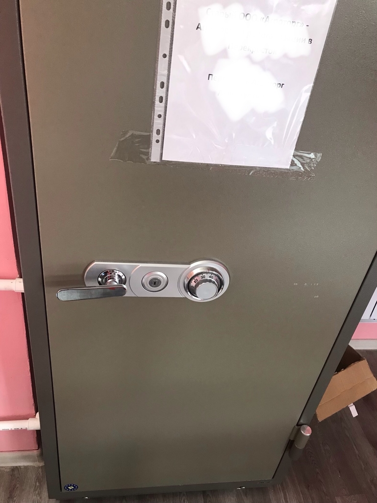

Наглядная демонстрация того, как работает лимбовый сейфовый замок, как на картинке.

У ручки замка и у дисков совпадает ось вращения. Первый диск называется ведущим, так как он скреплен с осью шплинтом. Остальные три или два называются ведомыми. Ведомые диски крутятся в зависимости от ведущего диска. Первый диск сам по себе напрямую взаимодействует только со вторым, второй диск передает момент вращения третьему, а третий – четвертому. Таким образом зависимые диски при вращении в одну сторону проворачиваются каскадом с разной скоростью. Диски соприкасаются друг с другом через выступы. Момент соприкосновения одного диска с другим можно услышать по характерному металлическому щелчку.

