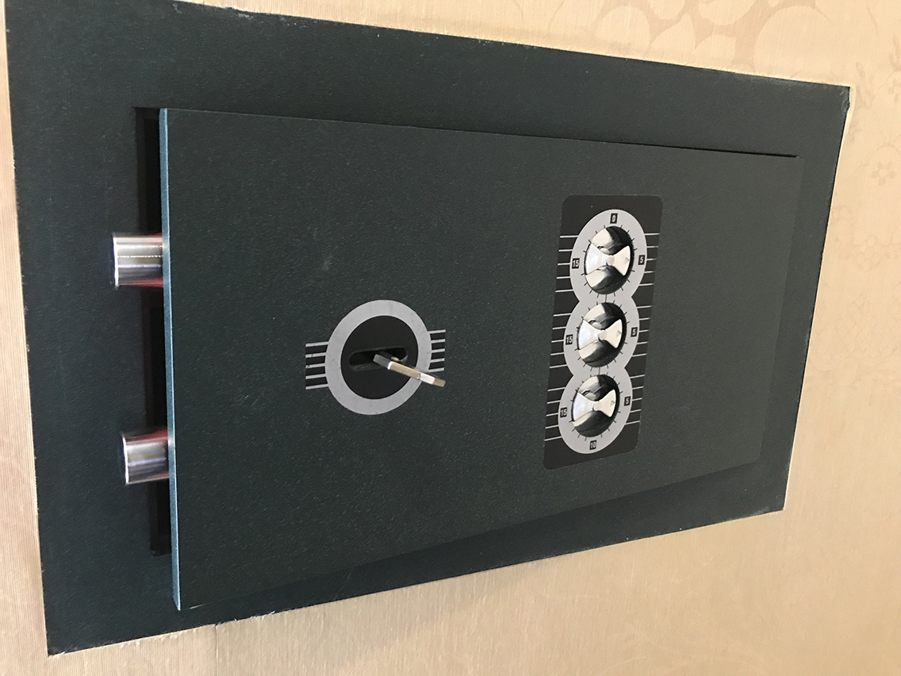

Ремонт кодового замка с заменой комбинации

Сейф рипост перестал открываться. Даже ручки набора кода не хотели вращаться. После аккуратного вскрытия сейфа был полностью разобран замок и установлена причина поломки. 

Ремонт был не сложный и сразу же была восстановлена работоспособность. Замок работает. Поменяли код на новый пока мастер рядом