Обычный ключ - это что-то из 20 века. Современный умный замок обеспечивает как безопасность, так и гибкость в настройке, позволяя вам контролировать доступ к вашему дому с помощью вашего телефона. И установка легче, чем вы думаете. Вот что вам нужно знать про лучшие умные замки, которые можно сегодня купить.

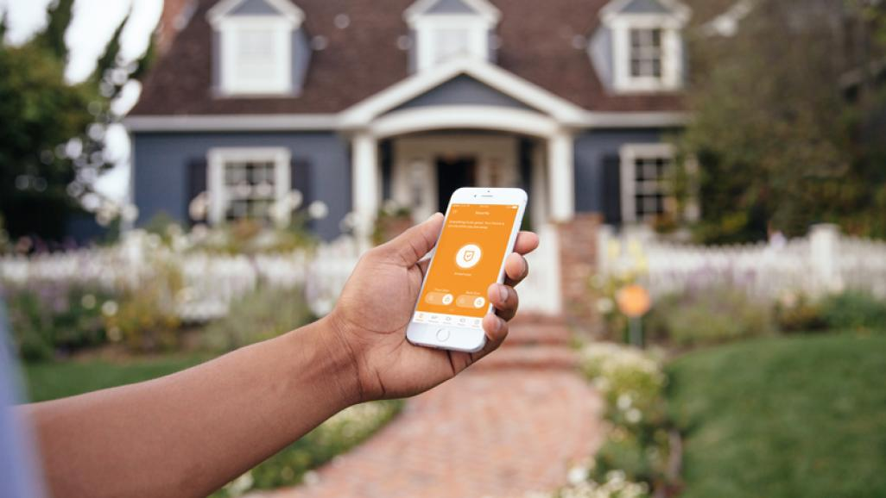

## Умный подход к обеспечению безопасности

Умный замок, возможно, является самой важной частью по-настоящему умного дома. Он не только позволит вам приходить и уходить, как вам угодно, он также будет контролировать, кто входит и выходит из вашего дома, пока вы отсутствуете. Некоторые модели просто позволяют использовать ваш телефон для открытия и закрытия дверей. Одни из них позволяют назначать особые привилегии друзьям, членам семьи или обслуживающему персоналу. Другие могут быть активированы с помощью голосовых команд или по команде из других интеллектуальных домашних устройств и служб. Вот несколько вещей, которые следует учитывать при принятии решения об установке смарт-замка, а также рассмотрим лучшие модели.

## Что такое умный дверной замок?

Одна из первых вещей, которую вы захотите рассмотреть, это то, сколько будет стоить обновление вашего традиционного замка. В конце концов, умный замок стоит намного больше, чем стандартный замок, который вы можете купить в местном строительном магазине. Вы можете найти несколько интеллектуальных блокировок в диапазоне $100 (не многие из которых сделали сокращение для этого списка), но если вы хотите, чтобы замок, которым вы можете управлять из любого места, с такими функциями, как голосовые команды, уведомления толчка и электронной почты, а также сигналы тревоги вскрытия, рассчитывайте заплатить где-то в диапазоне $200 до $300.

Многие смарт-замки предлагают мобильное приложение, которое позволяет блокировать и разблокировать двери с помощью простого значка крана. Некоторые из них предлагают веб-приложение, которое позволяет управлять вещами с вашего рабочего стола или портативного компьютера. Большинство приложений позволяют добавлять постоянных и временных пользователей и устанавливать расписание доступа для определенных дней и времени.

### Популярные модели
(Ссылки приводятся на сайт производителя, цены актуальны на апрель)

* [Ultraloq UL3 Bluetooth со сканером отпечатка пальца и сенсорным экраном](https://store.u-tec.com/pages/ul3-bt-bluetooth-enabled-fingerprint-and-touchscreen-smart-lever-lock) - **$250**
* [August Smart Lock Pro С Connect ](https://august.com/products/august-smart-lock-pro-connect)- **$199.99** 
* [Milocks Z-Wave](http://www.milocks.com/keyless-entry-digital-door-locks/ZWAVE.php) - **$193.99**

#### В целом о функциях

Если включена блокировка по Bluetooth, то вы должны быть в пределах досягаемости (около 12 метров), чтобы взаимодействовать с ним, в то время как замки со встроенным Wi-Fi можно управлять практически из любого места, пока они подключены к вашему домашнему маршрутизатору. Убедитесь, что ваш smart lock предлагает журналы действий, чтобы можно было посмотреть историю использования, чтобы увидеть, кто вошел или вышел из вашего дома и когда это произошло.

Самые новые умные замки предлагают такие вещи, как голосовая активация, геопозиция и функции автоматической блокировки. С активацией голоса легко запирать и открывать двери; просто скажите в ваш телефон "открой входную дверь" и замок это сделает. С функцией геопозиции вам никогда не придется беспокоиться о том, заперли ли вы дверь перед тем, как покинуть дом; просто настройте радиус автоматического закрытия вокруг вашего дома в мобильном приложение, и GPS точно будет определять ваше местоположение, дома вы или уже ушли. Когда вы выходите из указанной области, замок автоматически закроется позади вас. Аналогично, функция автоматической блокировки будет автоматически закрывать дверь после того, как она была открыта в течение определенного периода времени, по таймеру.

Из других функций можно упомянуть бесключевые сенсорные панели для тех случаев, когда у вас нет телефона или ключей, система несанкционированного доступа и сигнала тревоги, которая предупреждает вас о возможном взломе, а также текстовые и электронные уведомления, которые позволяют вам знать, кто приходит и уходит в режиме реального времени.

## Какие бывают умные дверные замки

#### Xiaomi Mijia Smart Door Lock: умный дверной замок с биометрикой

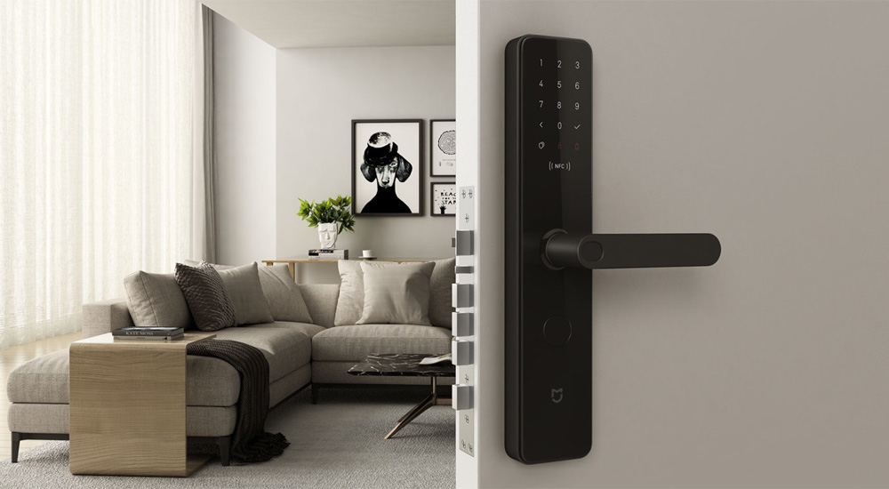

В комплект входит замок и пара дверных ручек с длинными основаниями. Mijia Smart Door Lock поддерживает шесть методов открытия:

- по отпечатку пальца;
- через приложение по NFC;
- через приложение по Bluetooth;
- механическим ключом;
- вход с постоянным кодом;
- вход со временным кодом;

Действительно, многие умные замки открываются **запасным физическим ключом,** в том числе и этот. Здесь присутствует механическая часть с личинкой, которая нужна на случай отказов остальной системы. Замочную скважину прикрывает круглая заглушка. Конструкция прочная: по идее, если злоумышленник уничтожит переднюю панель, ему все равно придется разбираться с механизмом внутри двери.

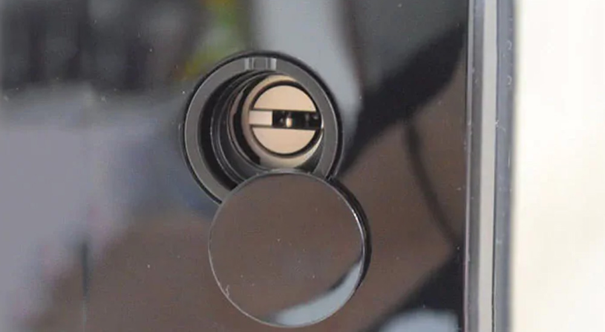

Корпус Mijia Smart Door Lock черного цвета, с минималистичным дизайном. У внешней части предусмотрен стеклянный светодиодный дисплей для ввода ПИН-кода. Устройство защищено от электромагнитного воздействия, чтобы внешние поля не сломали его. Внутрь встроены семь датчиков безопасности:

- датчик наличия ключа;
- датчики положения косого язычка;
- датчик положения углового язычка;
- датчик давления на ручку;
- датчик положения прямоугольного язычка;
- датчик положения язычка запирания;
- датчик вскрытия лицевой панели;

Датчики следят за состоянием замка и направляют уведомления о подозрительных происшествиях. Для этого потребуется подключить замок к системе умного дома Mihome через Bluetooth. Это дополнительный шаг дает доступ к интересной автоматизации. Скажем, открытие двери включает свет в квартире.

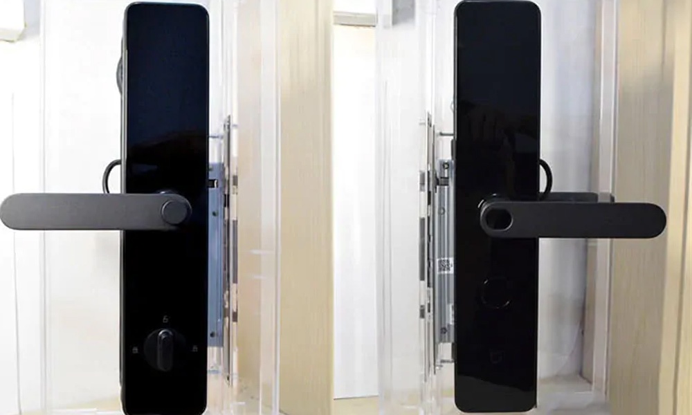

На оси ручки находится сканер отпечатков пальцев, который может отличать реальные отпечатки от «неживых». На практике сканер видит даже мокрые или грязные пальцы.

У Mijia Smart Door Lock есть ограничения. Устройство нельзя установить на кованые и стеклянные взломостойкие двери. Плюс, ему нужно достаточно места: площадь основания 365,6 x 75,6 миллиметра. Перед покупкой надо проверить, что умный замок точно вам подходит.

Замок работает от восьми пальчиковых батареек. В режиме простоя заряда хватит на 15 месяцев. Приложение будет предупреждать, в какой момент их нужно заменить. В случае, если вы забыли поменять батарейки, замок можно запитать снаружи от повербанка через вход microUSB и открыть дверь.

**[Ссылка](https://madrobots.ru/p/xiaomi-mijia-smart-door-lock/)**

#### Samsung SHP-DS510: умный замок без излишеств

Этот умный замок работает по коду, с RF-картами и запасным механическим ключом. Samsung SHP-DS510 удобен тем, что врезается в обычный вырез диаметром 54 мм. В комплекте есть электронная часть с личинкой, запасные ключи, ригель и ответная часть. Ручки нет, зато есть магнитный датчик, который определяет, закрыта ли дверь. Некоторые умные замки закрываются по таймеру и не понимают, что дверь специально держат открытой. Корейский замок все понимает отлично.

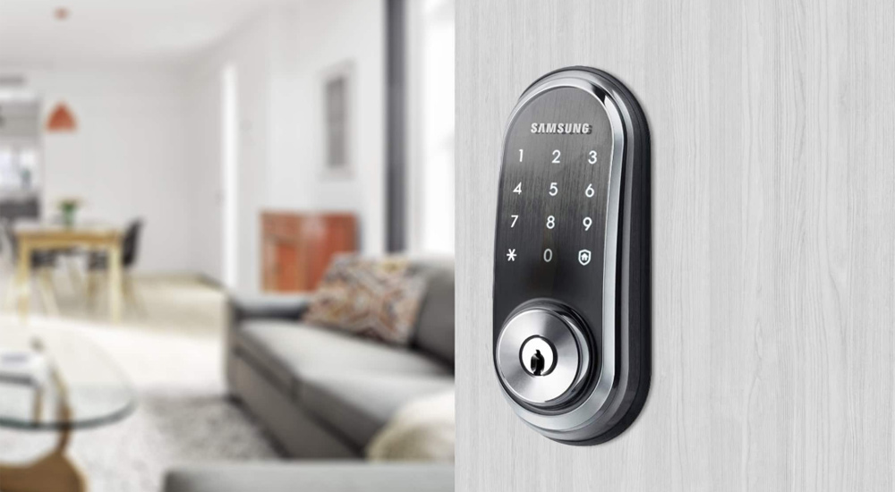

Материал корпуса SHP-DS510 - алюминий, сталь и поликарбонат. Передняя панель с сенсорным дисплеем - стеклянная. Чтобы на ней не остались отпечатки пальцев, которые бы выдали код, у замка есть система защиты. Дисплей сначала показывает пару случайных цифр, которые надо нажать, а затем уже включает все кнопки.

В память замка можно записать сотню паролей или RF-карт. Длина одного пароля составляет от 4 до 12 символов. Ограничение указано одно, по толщине двери: 35–55 миллиметров. Важный момент, для замка приложения нет, он работает отдельно от умного дома и настраивается автономно, через кнопки на дисплее. Тем не менее он произносит, что происходит, голосовыми сообщениями и сигналами. Громкость звука регулируется.

[plugin:youtube](https://www.youtube.com/watch?v=2QunOyg82v4)

Замок SHP-DS510 питается от четырех «пальчиковых» батареек, их хватит на год работы. Когда заряд начнет заканчиваться, на дисплее появится предупреждение. Если батарейки сели, замок можно легко вернуть к жизни, подключившись батарейкой на 9 вольт к контактам.

**[Ссылка](https://madrobots.ru/p/samsung-shp-ds510/)**

#### Danalock V3 Bluetooth + Z-wave: минималистично, модно, молодежно

Danalock V3 - это умный замок, который создатели позиционируют как максимально простую в управлении модель. Его можно установить самостоятельно: он подходит по размеру ко всем стандартным дверным вырезам, поставляется без ригеля и наружной панели. В комплекте есть: запасные ключи, болты, цилиндр, накладки и ручка, часть с мотором, и электронной начинкой.

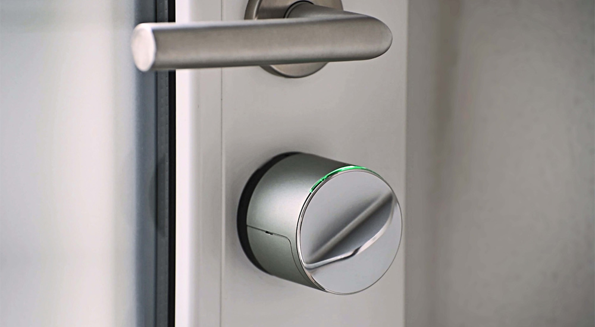

Мотор проворачивается, открывает и закрывает дверь. Корпус выполнен из анодированного алюминия. Когда замок открывается, светодиодная полоска на корпусе загорается зеленым светом. Когда закрывается, то красным. Замок питается от четырех батареек CR123A.

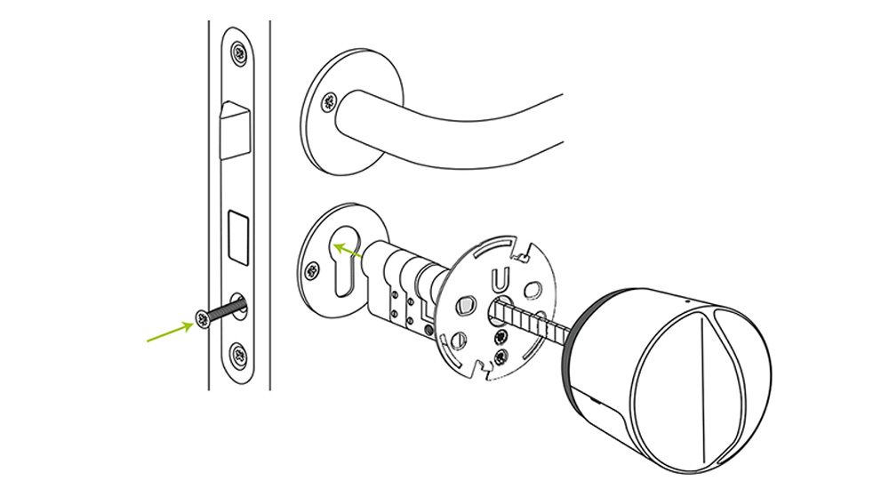

Предполагается, что у вас уже есть замок обычной конструкции. Развинчиваете его, вытаскиваете личинку, заменяете на ту, что идет в комплекте с Danalock V3. Затем заменяете фурнитуру на внутренней части двери на корпус с мотором. Снаружи остается замочная скважина под запасной механический ключ, внутри - дорогая электроника, которая не будет повреждена вандалами. Точно таким же образом устанавливается популярный August Smart Lock. Danalock - его давний конкурент.

[plugin:youtube](https://www.youtube.com/embed/oVPF8IJqPTE)

Ключ нужен для экстренных случаев. Обычно Danalock V3 открывается через фирменное приложение на смартфоне. Смартфон подключается к замку по Bluetooth. Для функционирования достаточно находиться в зоне действия связи. Через администраторский аккаунт выдаются виртуальные ключи остальным членам семьи и друзьям. Замок совместим с умным домом на базе Z-Wave. Если подключить Danalock V3 к соответствующему хабу, открывается широкий простор для настройки: удаленный доступ и оповещения о том, кто и как пользовался замком.

**[Ссылка](https://madrobots.ru/p/danalock-v3-bluetooth-z-wave/)**

## Как установить другие смарт-замки

Умные замки как правило не особенно сложны в установке, но некоторые из них ставить легче, чем другие. Если ваш новый замок поставляется как с внутренней накладкой (корпус, который вы устанавливаете на внутренней стороне вашей двери), так и с внешним компонентом (обычно сенсорной панелью или цилиндром с ключом), вам, вероятно, придется полностью снимать ваш старый замок, включая механизм засова и бронированную пластину, прежде чем вы сможете установить новое запорное устройство. Это просто вопрос удаления двух болтов, которые прикрепляют внутреннюю накладку к внешнему компоненту, и удаления обеих частей. Засов тоже обычно удерживается на месте двумя винтами.

Хорошая новость заключается в том, что большинство интеллектуальных замков используют стандартные предварительно просверленные отверстия, поэтому вам не нужно беспокоиться о сверлении новых. Кроме того, имеются смарт-замки, которые крепятся к внутренней стороне вашей двери и предназначены для использования существующего цилиндра с ключом и засовом, т. е. вам нужно только удалить внутреннюю накладку. В любом случае, вы можете рассчитывать на то, что потратите от 10 до 25 минут на удаление старого замка и установку нового смарт-замка.

## Может ли Google Home, HomePod или Alexa контролировать дверные замки?

Некоторые замки интегрируются с другими подключенными домашними устройствами, такими как [Nest Protect ](https://store.google.com/us/product/nest_protect_2nd_gen?hl=en-US)датчиками дыма, и устройствами, такими как Amazon Alexa, Apple HomeKit, Google Assistant, и [IFTTT](https://ifttt.com/). Например, вы можете разблокировать свои двери, когда срабатывает сигнал тревоги дыма или углекислого газа, или включить определенные умные лампочки, когда дверь открыта.

В зависимости от вашего домашнего оборудования вы можете даже связать свой замок с видеодомофоном, чтобы вы могли видеть кто находится у двери. Всё будет упираться только в ваш бюджет.

## Другие виды умных замков, универсальные умные замки

Такие устройства нужны для того, чтобы защитить от вскрытия шкафчик в фитнес-клубе, сумку, рюкзак. Часто применяют в воротах на даче. Хороший пробный вариант для тех, кто и хотел бы установить умный дверной замок, но боится пойти на радикальный шаг.

### Универсальный электрозамок GLS Bt+F

В России этот замок продается под брендом Grand lock systems, хотя в ранее был известен как Nokelock. Приложение у него так и называется: Nokelock (доступно для iOS и Android). Главный плюс: открытие по считыванию отпечатка пальца.

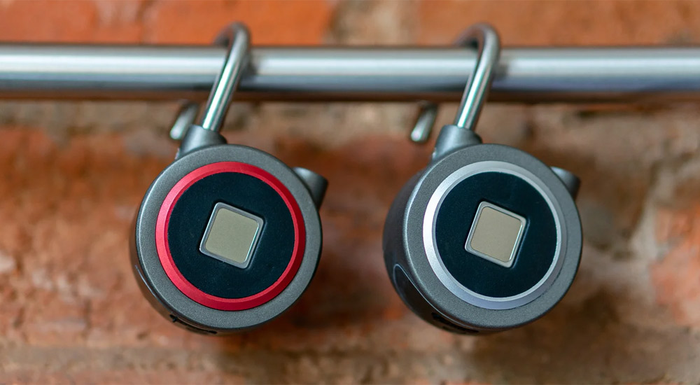

Сам по себе это небольшой навесной замок: 50х78х23 мм, который весит около 50 грамм. Спереди у него датчик считывания отпечатка пальцев, внутри - модуль Bluetooth с дальностью 1 метр. У корпуса степень защиты от влаги IP65: дождь и душ из садового шланга замок перенесет, а купание в колодце - нет. 

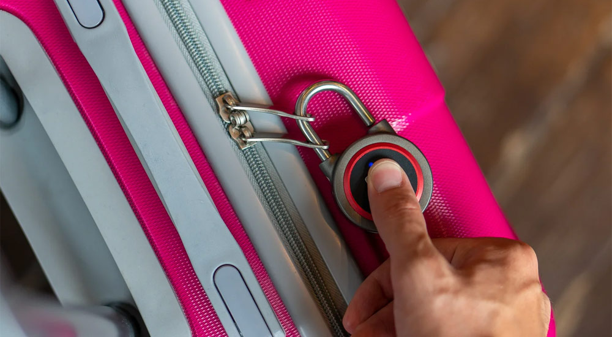

Аккумулятор емкостью 130 мАч подзаряжается от кабеля microUSB. Если замок разрядится - запустится снова от любого внешнего аккумулятора.

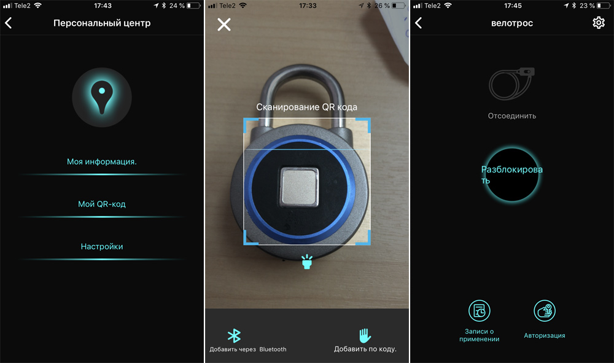

Замок запоминает 16 разных отпечатков пальцев и может быть использован различными людьми. Приложение записывает 1000 последних использований замка. Замок можно открывать пальцем или приложением (на случай, если отпечаток пальца не считывается).

**[Ссылка](https://madrobots.ru/p/gls-bt-plus-f/)**

### Универсальный электрозамок GLS Bt

Альтернатива GLS Bt+F без считывания отпечатков пальцев. Работает через то же самое приложение Nokelock, к которому подключается по Bluetooth. Размеры замка 50 х 78 х 23 мм, вес - 50 граммов. Защита корпуса всё такая же, IP65.

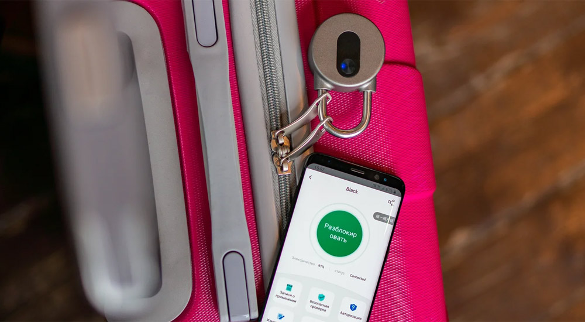

Замок работает от аккумулятора емкостью 800 мАч и заряжается кабелем microUSB. По идее, одной зарядки ему должно хватить на больший срок, чем более «умному» собрату.

Вы можете поделиться доступом к замку с другим человеком через установленное приложение. Кстати, для GLS Bt+F это тоже работает.

**[Ссылка](https://madrobots.ru/p/gls-bt/)**

## Умные велозамки

Самый подходящий способ использования «умных» замков - защита велосипедов от угона. Паркуете велосипед и закрываете замок смартфоном. Нет нужды возиться с ключами, достаточно нажать кнопку в приложении.

### Велосипедный электрозамок GLS Velolock Bt

Это тросовый замок, он пристегивает велосипед к неподвижному объекту гибким стальным тросом с оплеткой. Длина троса - 110 сантиметров, диаметр составляет 8 миллиметров, вместе с замком весит 400 граммов. Корпус водостойкий, IP65.

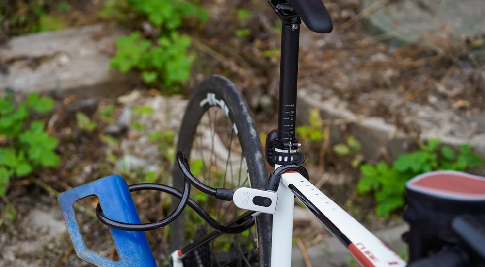

GLS Velolock Bt закрывается и открывается через приложение Nokelock. К смартфону гаджет подключается по Bluetooth. Батарея емкостью 800 мАч и заряжается через microUSB.

Как и в случае с универсальными навесными замками, приложение позволяет делиться доступом к замку. Не надо передавать никому физические ключи: поделитесь доступоом, и нужный человек сможет открыть GLS Velolock Bt и уехать на велосипеде.

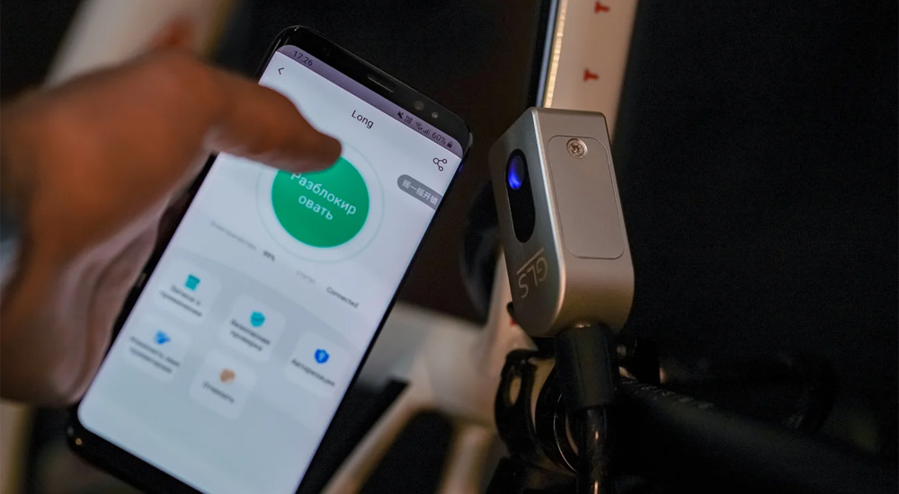

Безопасность GLS Velolock Bt - такая же, как и у других тросовых замков. Он прочный, однако при большом желании трос могут перекусить. Но гаджет точно не вскроют отмычкой.

**[Ссылка](https://madrobots.ru/p/gls-velolock-bt/)**

### Велосипедный электрозамок GLS U-lock Bt

GLS U-lock Bt, как ясно из названия - U-образный замок. Конструкция более надежная, чем у тросового, потому что дугу сложнее перекусить. Зато замок тяжелый и его нельзя использовать где попало, нужна велопарковка или забор.

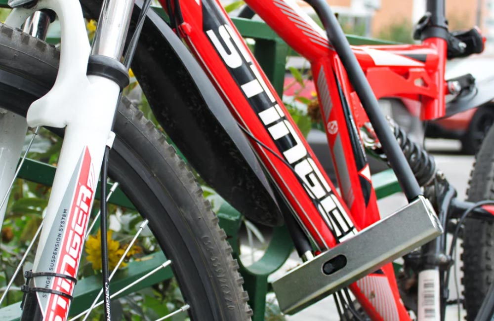

Длина GLS U-lock Bt составляет 32,5 сантиметров, ширина - 15 сантиметров. Замок металлический и весит 1,15 килограмма, корпус имеет класс защиты IP65. Емкость батареи составляет 800 мАч, которая заряжается через microUSB.

GLS U-lock Bt работает таким же образом: устанавливаете приложение Nokelock и подключаете замок по Bluetooth к смартфону. После этого открываете и закрываете его по нажатию кнопки, делитесь доступом с близкими, следите за тем, кто пользовался замком.

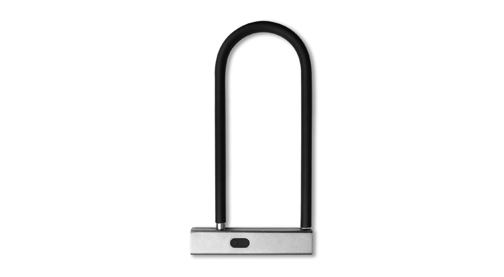

У модели есть традиционный ключ, которым ее можно открыть в случае технических неполадок или утери смартфона с приложением.

**[Ссылка](https://madrobots.ru/p/gls-u-lock-bt/)**

Источники: 

* https://habr.com/ru/company/madrobots/blog/465615/ 
* https://www.pcmag.com/picks/the-best-smart-locks