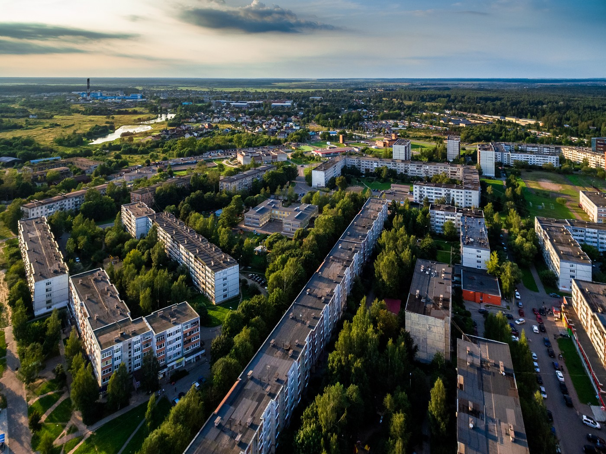
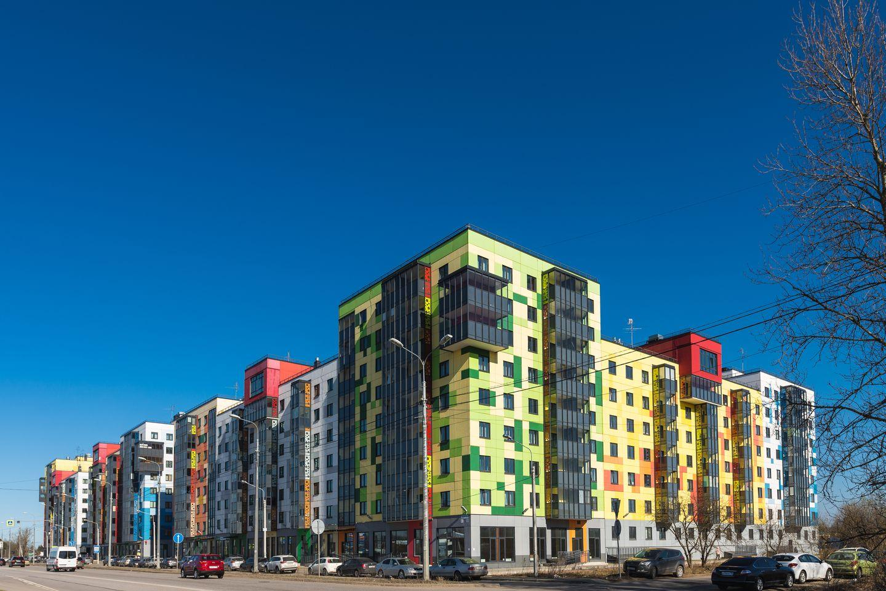

Оказываем услуги аварийного вскрытия замков, сейфов, автомобилей в городе Гатчина, Коммунар Гатчинского района Ленинградской области. 

Если Вы оказались в такой сложной ситуации перед запертой дверью, когда замок не открывается или потеряны ключи то наша служба сможет Вам помочь и отрыть замок без повреждения двери. 



Сможем легко открыть Вашу машину если нужно в нее попасть а ключи, например, закрылись в салоне или багажнике. Вскроем замок сейфа без повреждения содержимого. Установим новые замки или поменяем старые полностью или частично с заменой кодового элемента.

### Вскрытие автомобилей  в Гатчине

Предлагаем услуги по вскрытию авто в Гатчине, Коммунар. Приедем на помощь в срочном порядке, вскроем Ваш автомобиль аккуратно, без повреждений кузова, замков и стекол. Открываем абсолютно любые марки автомашин, от малолитражек до грузовых тягачей, отечественных и иномарок. 



Поможем вскрыть замки рейлингов, автобагажника, дополнительного замка капота и блокиратора КПП. Работаем профессиональным инструментом и всевозможными приспособлениями с гарантией 100% результата вскрытия.

### Вскрытие дверей в Гатчине

В нашей службе каждый день на дежурстве мастер, если нужна помощь по вскрытию дверей в городе Гатчина, Коммунар.  Имеем все необходимые инструменты и приспособления для оказания качественного сервиса. 

Мы сможем аккуратно вскрыть дверь Вашей квартиры, офиса, частного дома или гаража. При необходимости отремонтируем или заменим неисправный замок сразу на месте. Вскрываем замки на металлических, деревянных и металлопластиковых дверях, как при потере (поломке) ключа, так и при заклинивании замка.

### Вскрытие сейфов в Гатчине

Вскрытием замков сейфов в нашей службе занимаются мастера только с большим профессиональным опытом. Мы поможем Вам открыть сейф в Гатчине, Коммунар, будь он домашний или офисный, импортный или отечественный, механический с ключом, лимбом (кодом) или с электронным управлением. 



Вскроем сейф качественно, его содержимое будет в целости и сохранности, т.к. не используем болгарку и газовый резак, работаем специальным инструментом. Возможно оказание ремонта и замены сейфового замка при каких-либо неисправностях.

### Ремонт, замена, установка замков в Гатчине

Мы предлагаем услуги по ремонту замков, замене и установке дверных замков, обслуживая на выезде город Гатчину, Коммунар и весь Гатчинский район. 



Заменим цилиндр замка, нуклео, ротор или корпус замка, сделаем подгонку, регулировку замка, расточим ответную часть коробки двери (если необходимо). У Вас сломался замок на двери или хотите поставить дополнительный? Звоните, постараемся помочь. 

Наш специалист в Вашем районе готов приехать по договоренности в любую точку района и провести осмотр двери, замка. После согласования всех нюансов мероприятия, мастер сразу приступает к работе.
