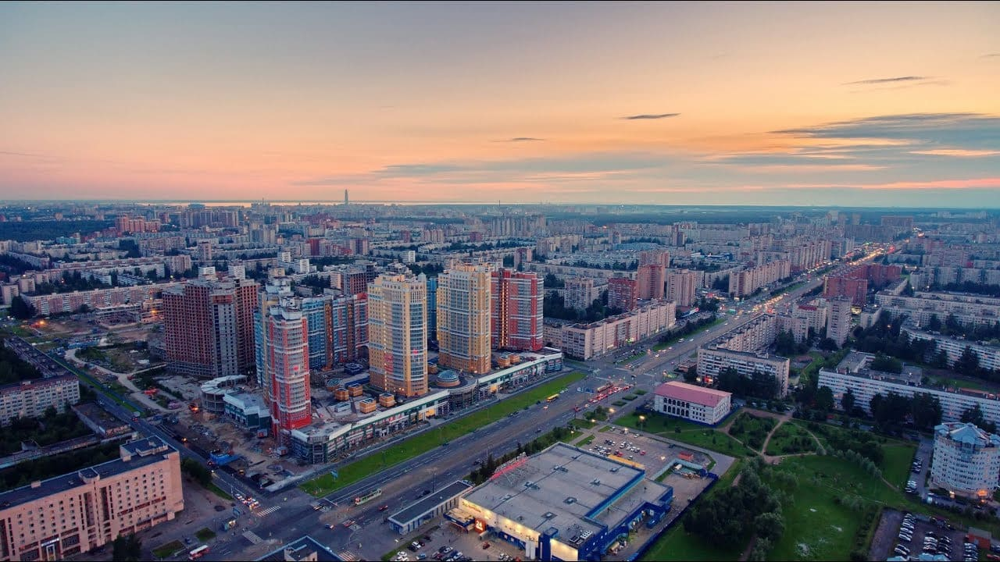
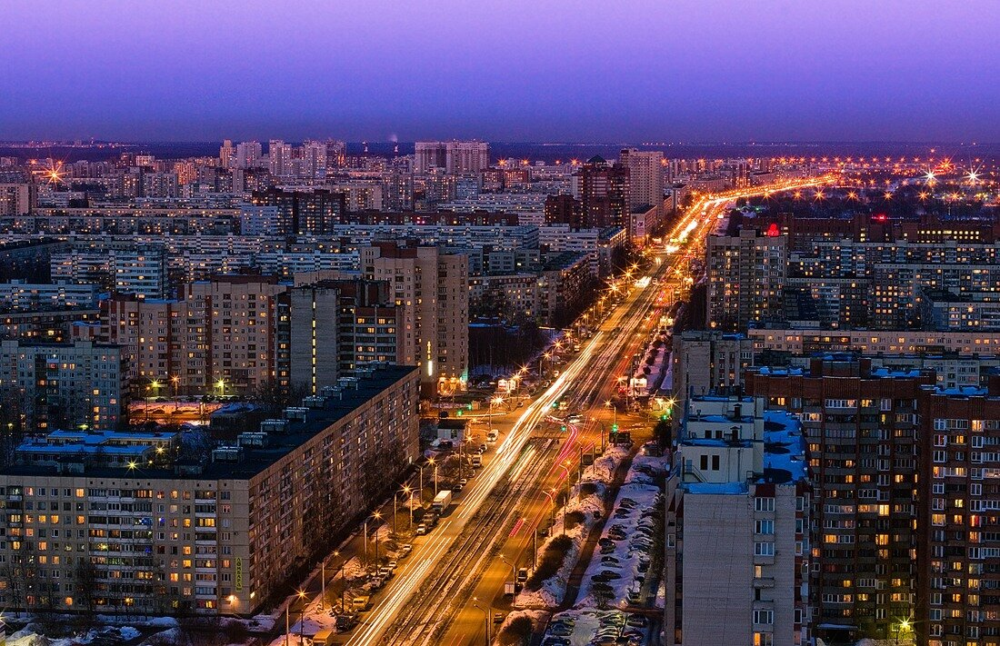
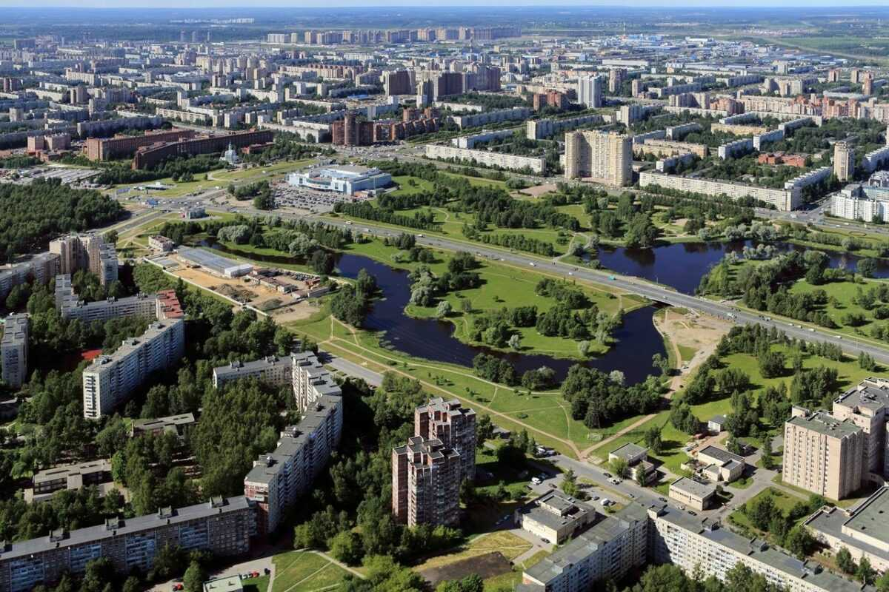
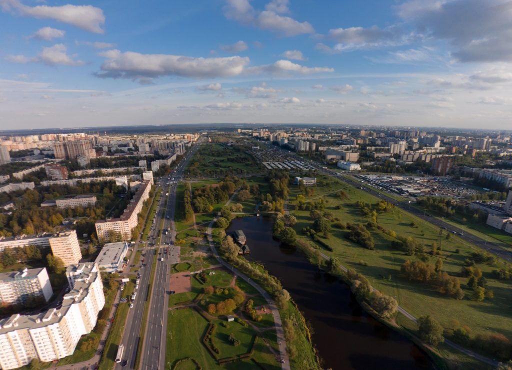
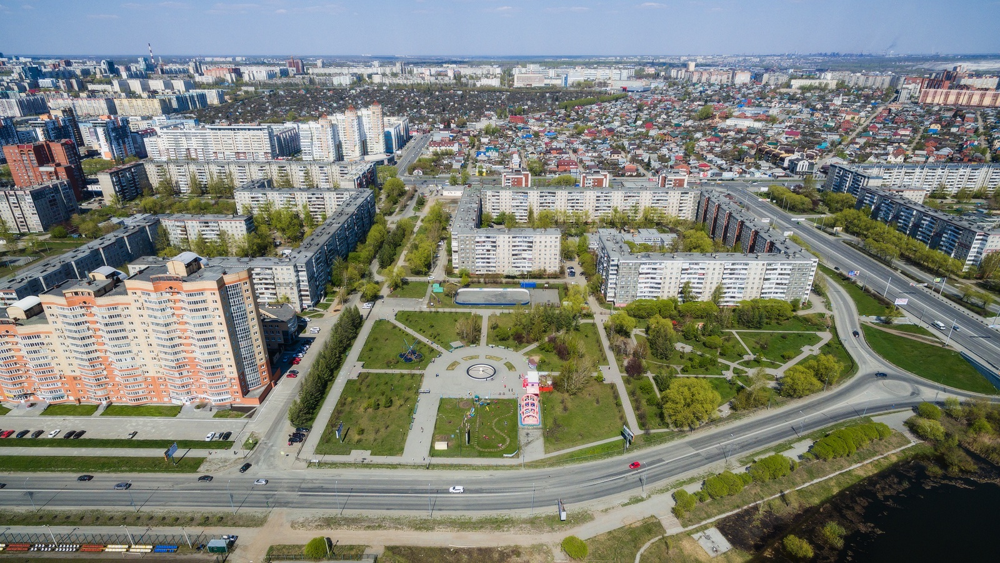

Поможем вскрыть замок двери, сейфа, авто в Калининском районе

Аварийное вскрытие замков дверей, автомобилей, сейфов в Калининском районе. Мы оперативно выезжаем на вызов, когда
необходимо экстренно вскрыть замок Вашей двери, авто или сейфа. 



Беремся за работу абсолютно любой сложности и объемов.
Вскроем замок профессионально, без повреждений двери! Работаем круглосуточно.

### Вскрытие дверей в Калининском районе

Мы открываем двери без повреждений, так как имеем большой опыт в сфере оказания услуг вскрытия замков, а также
пользуемся специальным профессиональным инструментом. Поможем вскрыть металлическую, деревянную, металлопластиковую
дверь в Калининском районе. Устраняем проблемы с замками в случае их поломки и износе механизма, потере ключа. 

Вскроем
любую щеколду, ночную защелку или задвижку на двери любого типа. Наличие у Вас документа (паспорт с регистрацией,
договор купли-продажи, договор аренды или нотариальная доверенность) на вскрываемый объект обязательно! В противном
случае мы оставляем за собой право отказать в проведении мероприятия.

### Вскрытие автомобилей в Калининском районе

Если Вы автовладелец, то наверняка, хотя бы раз попадали в ситуацию, когда Вам было не попасть в свой авто по причине,
севшего аккумулятора или, когда машина закрылась сама, а ключ остался внутри салона или багажника. В подобных ситуациях
наша служба поможет Вам открыть автомобиль в Калининском районе совершенно без повреждений замков, стекол,
лакокрасочного покрытия кузова.



Успешно вскрываем как легковые, так и грузовые авто, отечественные и иномарки. Перед
проведением работ по вскрытию автозамка Вами должен быть предъявлен документ на право владения или управления этим ТС.

### Вскрытие сейфов в Калининском районе

Для аккуратного вскрытия сейфа нужно, знать устройство его замка и запорного механизма, а также знать все его слабые
места и, к примеру, возможные причины сбоев, неисправностей в работе механизмов замка. К тому же, важно наличие опыта
вскрытия сейфов и высокоточного инструмента. Наши мастера владеют отличными навыками в подобных операциях, и оснащены
необходимыми техническими средствами для успешного и качественного вскрытия сейфов. 

Мы поможем Вам открыть любой сейф в
городе Калининском районе. Откроем металлический ящик, оружейный шкаф, терминал или прочий объект с сейфовым замком.
Гарантируем сохранность содержимого сейфа после вскрытия, а также порядочность и конфиденциальность мероприятия.

### Установка и замена замков в Калининском районе

Осуществляем профессиональную работу по установке любых замков в Калининском районе на различные виды дверей (
металлические, деревянные, металлопластиковые). Мастер по установке замков выполняет все работы на безупречном уровне и
готов приехать на установку замка в день звонка. 

Выполняем также замену замков, ручек, цилиндров, роторов, перекодировку
и пр. Замки популярных брендов всегда в наличии. Мастер готов их заменить сразу после вскрытия заклиневшего механизма
или приехать в любое удобное для Вас время по договоренности.

М. Гражданский пр., Академическая, Политехническая, пл. Мужества, пл. Ленина