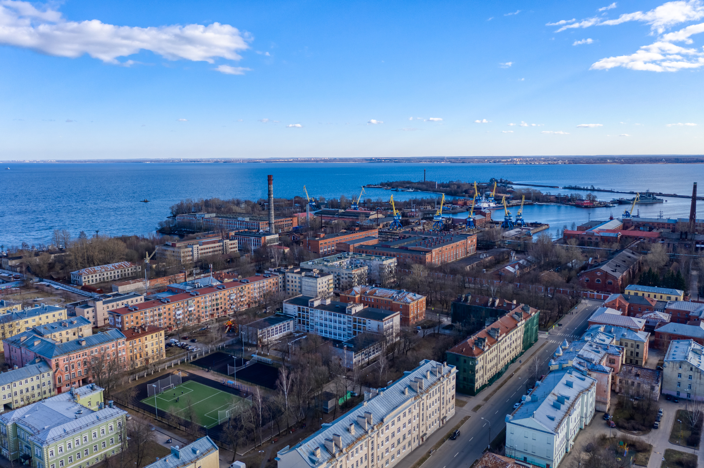
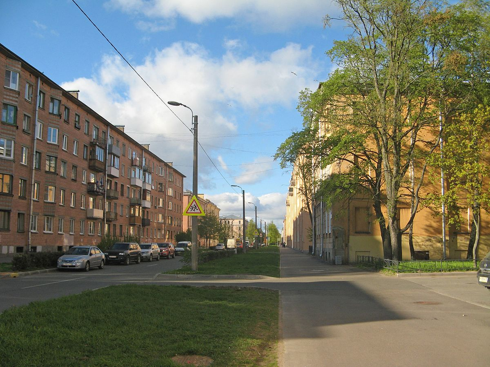
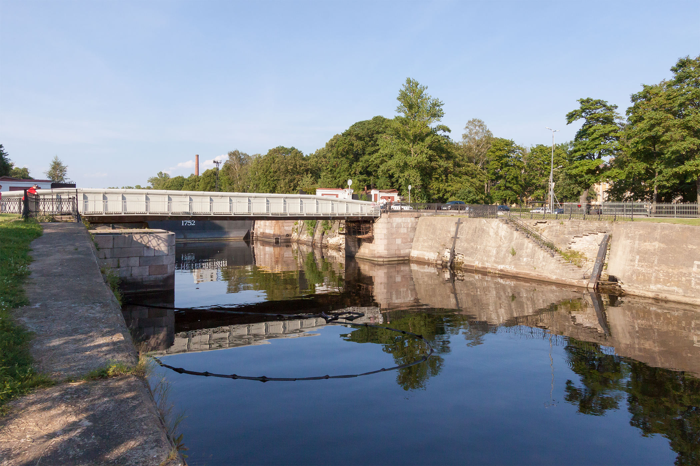

Аварийное экстренное вскрытие замков дверей, сейфов, автомобилей в Кронштадте. Мы оперативно выезжаем на заказ, когда необходимо срочно вскрыть замок Вашей двери, авто или сейфа.

### Поможем вскрыть замок двери, сейфа, авто в городе Кронштадт

Беремся за работу любой сложности и объемов. Вскроем замок профессионально! Работаем круглосуточно.



### Вскрытие дверей в Кронштадте

Мы открываем двери без повреждений, так как имеем большой практический опыт в сфере оказания услуг вскрытия замков, а также пользуемся специальным высокоточным инструментом. 



Поможем вскрыть металлическую, деревянную, металлопластиковую дверь в Кронштадте. Решаем проблемы с замками при их поломках и износе механизма, потере ключа. Вскроем любой засов, ночную защелку или задвижку на двери любого типа. 

Наличие у Вас документа (паспорт с регистрацией, договор купли-продажи, договор аренды или нотариальная доверенность) на вскрываемый объект обязательно! В противном случае мы оставляем за собой право отказать в проведении мероприятия.

### Вскрытие автомобилей в Кронштадте

Если Вы автовладелец, то наверняка, хотя бы раз попадали в ситуацию, когда Вам было не попасть в свой авто по причине, скажем, севшего аккумулятора или, когда машина закрылась сама, а ключ остался внутри салона или багажника. 



В данных и подобных ситуациях наша служба поможет Вам открыть автомашину  в Кронштадте без каких-либо повреждений замков, стекол, лакокрасочного покрытия кузова. Успешно вскрываем как легковые, так и грузовые авто, отечественные и иномарки. 

Перед проведением работ по вскрытию автозамка Вами должен быть предъявлен документ на право владения или управления этим ТС.

### Вскрытие сейфов в Кронштадте

Для того, чтобы аккуратно и результативно вскрыть сейф нужно, как минимум, знать устройство его замка и запорного механизма, а также знать все его слабые места и, к примеру, возможные причины сбоев, неисправностей в работе замка. 



Плюс, разумеется, важно наличие опыта вскрытия сейфов и профессионального инструмента. Наши мастера владеют хорошими навыками в подобных делах, и оснащены необходимыми техническими средствами для успешного и качественного открывания сейфов. Мы поможем Вам открыть любой сейф в городе Кронштадт. Откроем металлический ящик, шкаф, терминал или прочий объект с сейфовым замком. Гарантируем сохранность содержимого сейфа после вскрытия, а также порядочность и конфиденциальность мероприятия.

### Установка замков город Кронштадт

Выполняем профессиональную работу по установке любых замков в Кронштадте на все виды дверей (металлические, деревянные, металлопластиковые). Мастер по установке замков выполняет все работы на высшем уровне и готов приехать на установку замка в день заказа. 

 

Выполняем также замену замков, ручек, цилиндров, роторов, нуклий, перекодировку и пр. Замки популярных брендов всегда в наличии. Мастер готов их заменить сразу после вскрытия заклиневшего механизма или просто приехать в любое удобное для Вас время.
