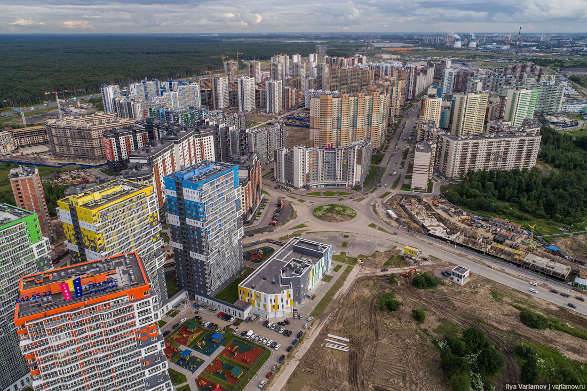
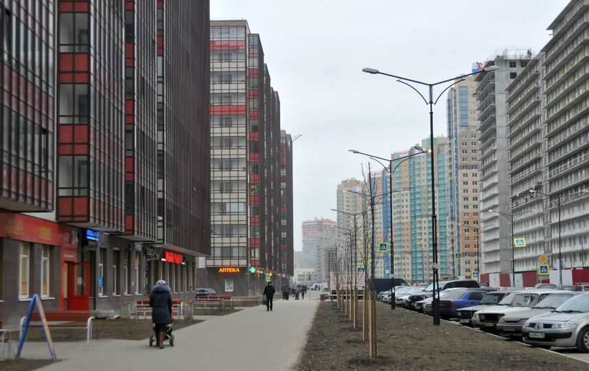
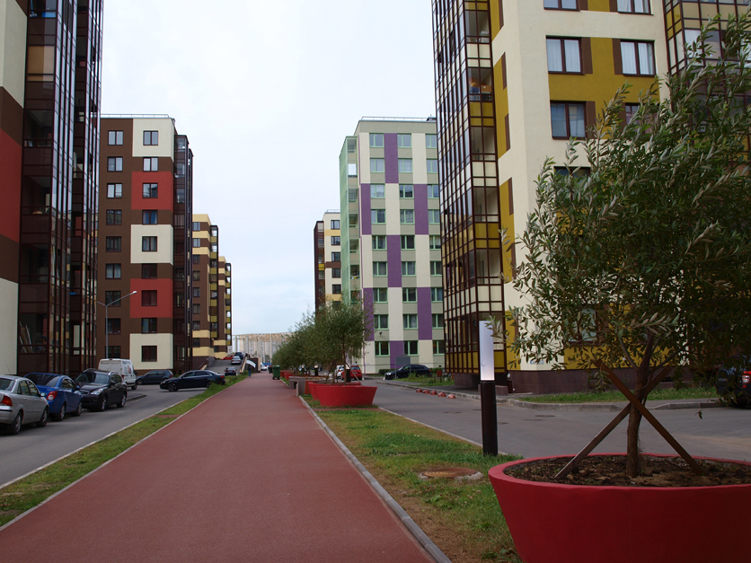
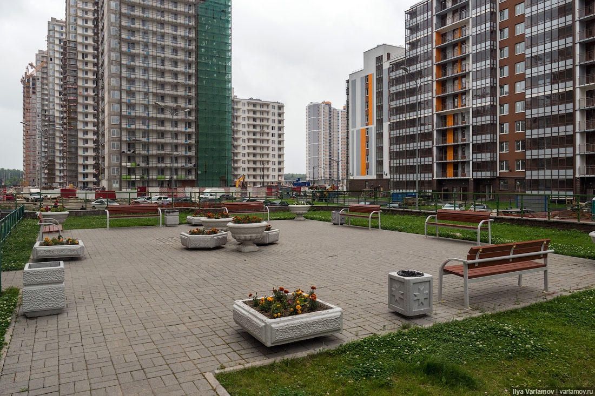

Мы оперативно выезжаем на заказ, когда необходимо срочно вскрыть замок Вашей двери, авто или сейфа в Кудрово. 

Беремся за работу любой сложности и объемов. Вскроем замок профессионально! Работаем терретории крупных ЖК (Новый Оккервиль) и по всей территории Кудрово.



### Вскрытие дверей в Кудрово

Мы открываем двери без повреждений, так как имеем большой практический опыт в сфере оказания услуг вскрытия замков, а также пользуемся специальным высокоточным инструментом. 



Поможем вскрыть металлическую, деревянную, металлопластиковую дверь в Кудрово. Решаем проблемы с замками при их поломках и износе механизма, потере ключа. Вскроем любой засов, ночную защелку или задвижку на двери любого типа. 

Наличие у Вас документа (паспорт с регистрацией, договор купли-продажи, договор аренды или нотариальная доверенность) на вскрываемый объект обязательно! В противном случае мы оставляем за собой право отказать в проведении мероприятия.



### Вскрытие автомобилей в Кудрово

Если Вы автовладелец, то наверняка, хотя бы раз попадали в ситуацию, когда Вам было не попасть в свой авто по причине, скажем, севшего аккумулятора или, когда машина закрылась сама, а ключ остался внутри салона или багажника. 

В данных и подобных ситуациях наша служба поможет Вам открыть автомашину  в Кудрово без каких-либо повреждений замков, стекол, лакокрасочного покрытия кузова. Успешно вскрываем как легковые, так и грузовые авто, отечественные и иномарки. 

Перед проведением работ по вскрытию автозамка Вами должен быть предъявлен документ на право владения или управления этим ТС.

### Вскрытие сейфов в Кудрово

Для того, чтобы аккуратно и результативно вскрыть сейф нужно, как минимум, знать устройство его замка и запорного механизма, а также знать все его слабые места и, к примеру, возможные причины сбоев, неисправностей в работе замка. 

Плюс, разумеется, важно наличие опыта вскрытия сейфов и профессионального инструмента. Наши мастера владеют хорошими навыками в подобных делах, и оснащены необходимыми техническими средствами для успешного и качественного открывания сейфов. Мы поможем Вам открыть любой сейф в Кудрово. 

Откроем металлический ящик, шкаф, терминал или прочий объект с сейфовым замком. Гарантируем сохранность содержимого сейфа после вскрытия, а также порядочность и конфиденциальность мероприятия.

### Ремонт, замена, установка замков в Кудрово

Мы предлагаем услуги по ремонту замков, замене и установке дверных замков, обслуживая на выезде район Кудрово. Заменим цилиндр замка, нуклео, ротор или корпус замка, сделаем подгонку, регулировку замка, расточим ответную часть коробки двери (если необходимо). 

У Вас сломался замок на двери или хотите поставить дополнительный? Звоните, постараемся помочь. Наш специалист в Вашем районе готов приехать по договоренности в любую точку района и провести осмотр двери, замка. После согласования всех нюансов мероприятия, мастер сразу приступает к работе.