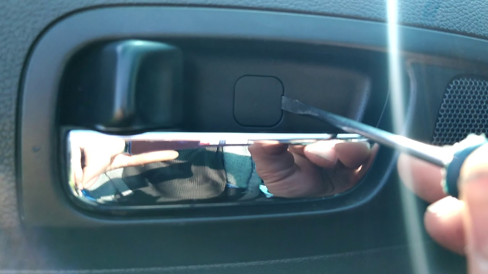
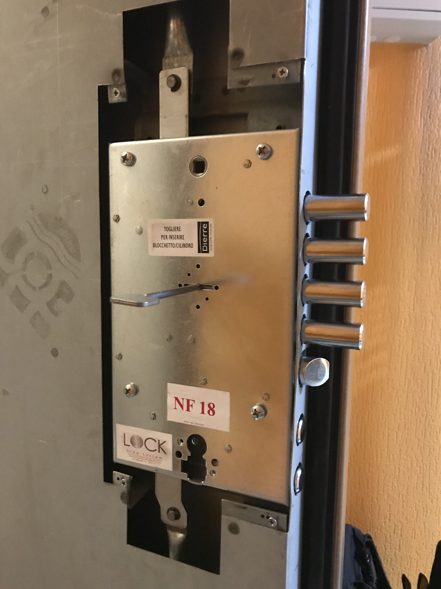
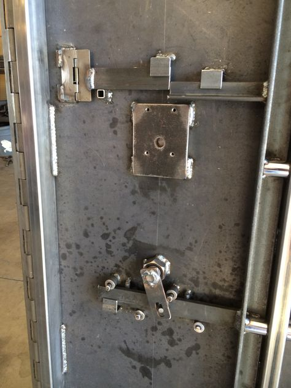
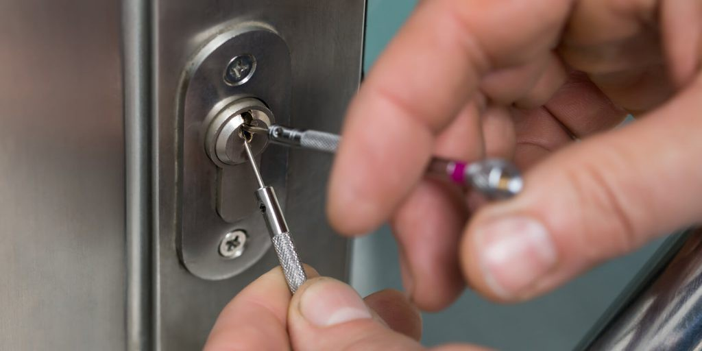





















#### Вскрытие замков

Специалисты, работающие в Энигме, занимаются своей работой уже давно. Есть несколько подходов к замку, которые откроют дверь без повреждения  её поверхностей. Будь то магнитный, электронный, цилиндровый, сувальдный или кодовый  замок.

Например, сувальдный состоит из металлических пластин, каждая со  своей формой и специальным вырезом. Ключ для таких замков имеет  зазубрины, попадающие в пазы замка и двигающие пластины, что отпирает устройство. В таком случае  можно прибегнуть к копированию формы ключа с помощью набора штифтов -  наборного ключа. Может пригодиться декодер или самонаборный ключ.

### Услугу аварийного вскрытия замков в Санкт-Петербурге можно заказать вызвав мастера по телефону +7&#160;(921)&#160;940&#160;50&#160;94

Если замок по какой-то причине открыть по другому невозможно, мастер  может высверлить замок, либо его составные части, такие как: хвостовик,  засов или ригели. Всё необходимое оборудование, а главное – опыт, есть у наших мастеров.  Мы решим вашу проблему.

#### Установка замков

Компания Энигма также занимается установкой. При необходимости после  вскрытия замка вы можете его сразу заменить на более надежный или  поставить такой же, к которому Вы привыкли. Обычно качество прямо пропорционально цене, но, чтобы быть уверенными  всегда можно проконсультироваться с мастером на месте, и он поделится  опытом.

> Возможные причины для замены замка
> - Вы купили новую квартиру и чтобы обезопасить свое имущество необходимо заменить замки
> - Вы беспокоитесь за свою безопасность. Можно установить дополнительный хороший замок
> - Старый замок сломался или начинает заедать механизм
> - Украли или потеряли ключи
> - Дверь пытались вскрыть злоумышленники
> - Делали ремонт в доме и отдавали ключи другим мастерам

При возникновении хоть одной из причин обратитесь к нам, чтобы мастер с опытом работ посоветовал вам что-то новое или просто установил понравившийся вам замок

### Если заклинил замок или сломался ключ вызовите мастера по вскрытию замков позвонив по телефону +7&#160;(921)&#160;940&#160;50&#160;94

Квалифицированные работники производят замену замков в двери, установят замок на место старого. Мы работаем  круглосуточно – вы можете позвонить прямо сейчас, и мастер срочно  приедет.

#### Вскрытие автомобилей

Наша компания поможет вам, мастер откроет машину с максимально  возможной оперативностью и без каких-либо повреждений. Никаких разбитых  стёкл или других повреждений. Вы сможете сразу поехать на Вашем автомобиле. Заклинивший замок двери –  это не единственная сфера действия нашей фирмы.

Профессионалы  Энигмы экстренно вскрывают и автомобили. Вскрытие замков производится без повреждений, быстро и с гарантией. Для  мастера не важна марка двери или авто, так как мастер работает по  большей части с замком, поэтому поверхность не пострадает.

#### Вскрытие сейфов

Каждое вскрытие сейфа – задача индивидуальная из-за сложности  конструкции, ведь его основная задача – надёжно запереть содержимое. Но  даже к этим металлическим крепостям всегда находится подход. Не так эффектно, как в фильмах, но почти также быстро наши специалисты  откроют сейф любого производителя.

### Поможем вскрыть сейф без ключа или кода. Недорого. Вызовите мастера по телефону +7&#160;(921)&#160;940&#160;50&#160;94

Замки будут вскрыты без повреждений за минимальное время. Обладая большим опытом работы с кодовыми и электронно-кодовыми запорными устройствами как старых образцов, так и новейших систем безопасности M-LOCKS и Cisa.