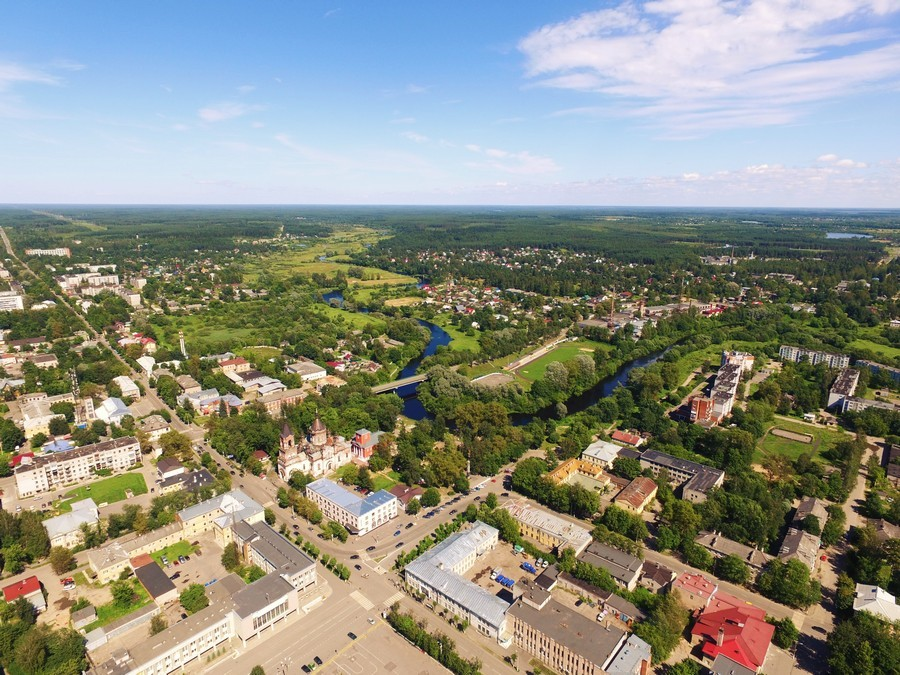
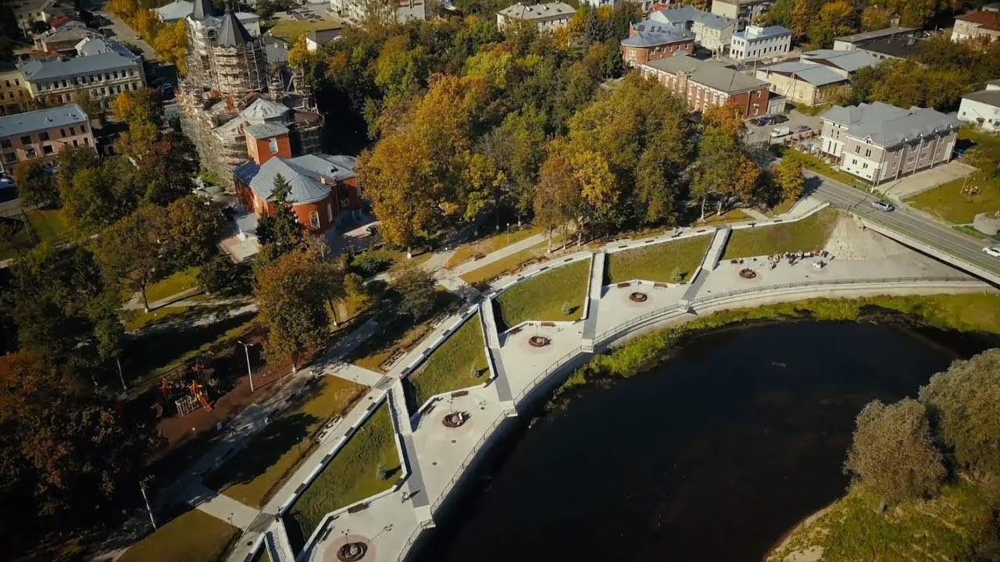
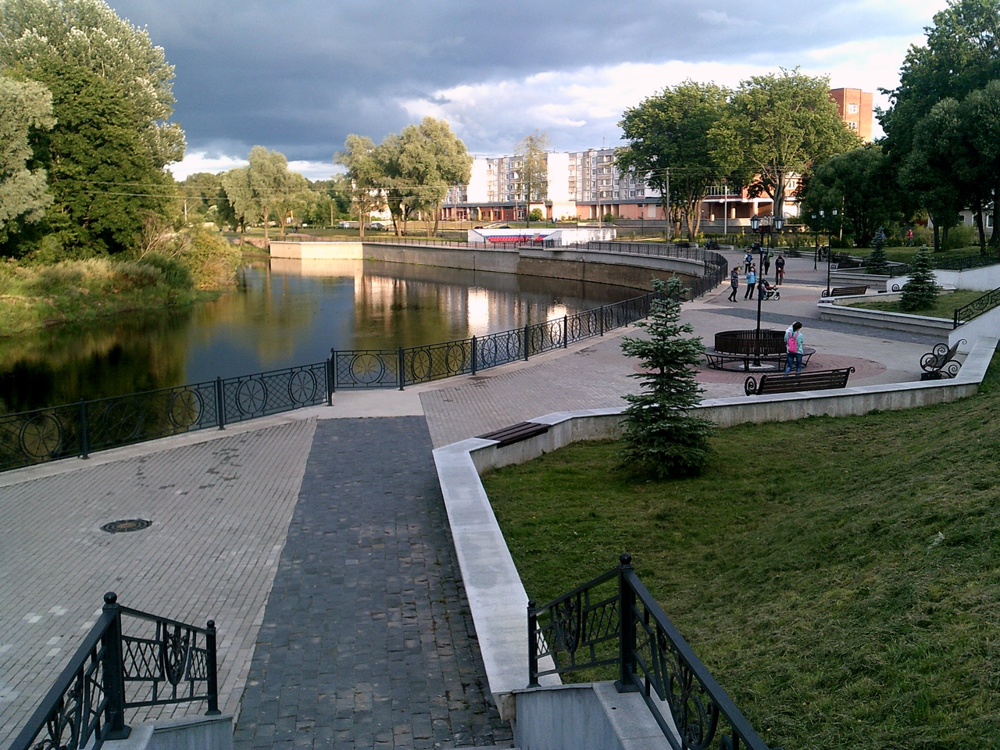
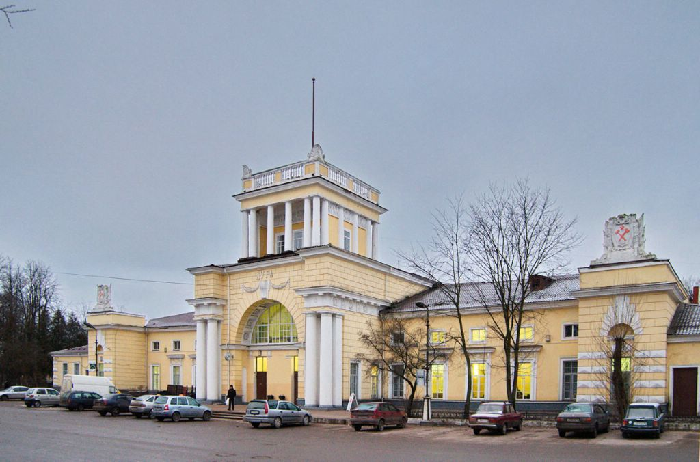
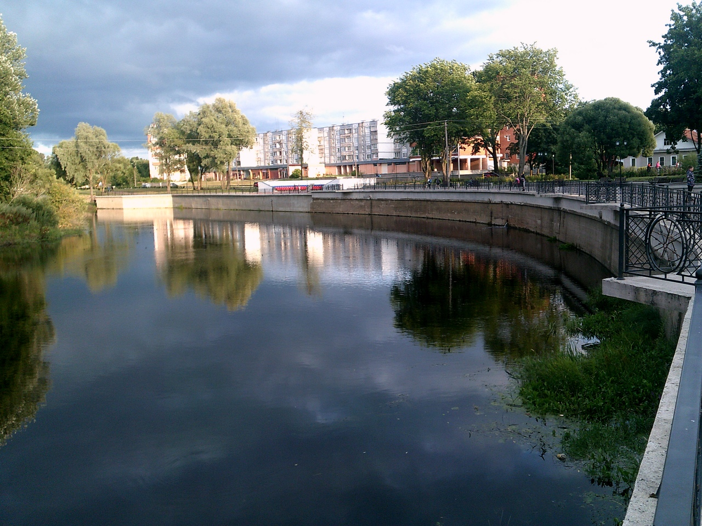
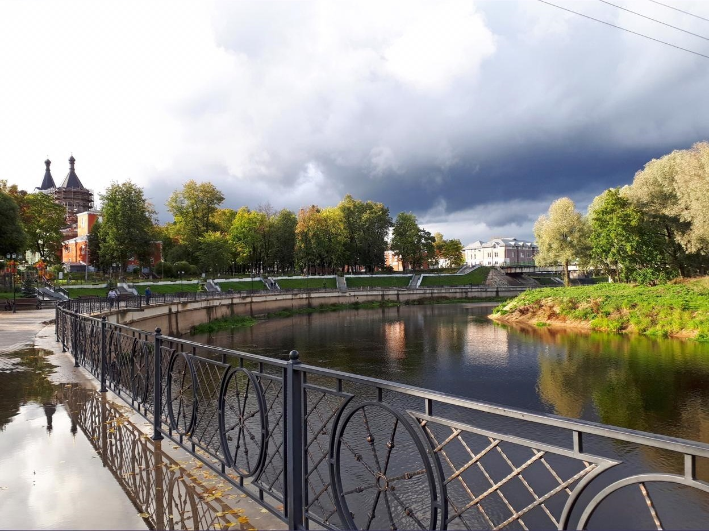

Предоставляем услуги по вскрытию дверных замков, автомобилей, сейфов, гаражей в г. Луга и любом соседнем населенном
пункте (п. Оредеж, Мшинская, Рождествено, Толмачево, Заклинье, Кузнецово и т.д.) . 



Оперативно выезжаем по звонку на
адрес заказчика и помогаем в сложившейся ситуации вскрыть замок, который мог сломаться, заклинить или, например,
потерялись ключи. 

При необходимости сразу можно заменить, вышедшие из строя, замки, цилиндры, перекодируем под новые
ключи, меняем роторы. Установка замка на новое место тоже легко произведется нашим специалистом. Звоните

### Вскрытие замков в Луге

Мы готовы прийти на помощь и вскрыть дверной замок любого типа и сложности. Успешно открываем цилиндровые, сувальдные,
дисковые, роторные замки дверей квартир, офисов, гаражей и других помещений. 



Нам под силу открыть как обычные деревянные
двери, так и металлические с усиленной защитой замков. При этом работа осуществляется аккуратно и без повреждений
дверного полотна.

### Вскрытие автомобилей в Луге

У Вас захлопнулся заведенный автомобиль? Машина закрылась, а ключ остался в салоне? Или разрядился аккумулятор? Не
зависимо от того, какая ситуация привела заблокированию замка автомобиля , мы готовы срочно приехать по Вашей заявке.
Откроем дверь салона, капот или багажник автомобиля без повреждений. 

Поможем вскрыть автомобиль, а также замки
рейлингов, автобагажников, а также мотозамки, кофры, замки бензобаков. Разблокируем любые механические противоугонные
замки.

### Вскрытие сейфов в Луге

Если у Вас проблема открыть сейф, а именно потерялся ключ, забыли код или сломался замок, мы сможем помочь, причем в
самые короткие сроки. С аккуратным подходом вскроем любой сейф, ящик или оружейный шкаф, не повреждая внутреннего
содержимого, целостности сейфа и зачастую самого замка. 

Мы имеем большой опыт вскрытия сейфов любых классов, используем
профессиональные инструмент и специальные приспособления. Деликатно сможем вскрыть механический и электронный сейф.
Работаем как с частными лицами, так и с организациями, по наличному и безналичному расчёту.

### Установка замков в Луге

Мы предлагаем услуги по ремонту замков, замене и установке дверных замков на новое место. Заменим цилиндр замка, ротор
или корпус замка, сделаем подгонку, регулировку замка, расточим ответную часть коробки двери (если необходимо). У Вас
сломался замок на двери или хотите поставить дополнительный? 

Звоните, мы подробно проконсультируем Вас и наш специалист
готов приехать по договоренности в любую точку района и провести осмотр двери, замка. После согласования всех нюансов
мероприятия, мастер сразу приступает к работе.
