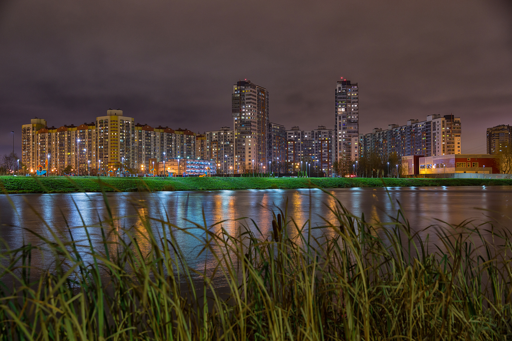

Мы предлагаем оперативное аварийное вскрытие замков дверей, автомобилей, сейфов в Приморском районе г. Санкт-Петербурга.
Открываем замки любой сложности и типов на территории крупных ЖК, таких как ЖК Чистое небо, и во всем Приморском районе.



Кроме вскрытия, производим ремонт, замену, установку дверных, сейфовых,
автомобильных замков в Приморском районе.

### Вскрытие дверей в Приморском районе

В нашей службе каждый день на дежурстве мастер, если нужна помощь по вскрытию дверей в Приморском районе. Работаем
круглосуточно. Имеем все необходимые инструменты и приспособления для оказания высококвалифицированного сервиса. Мы
сможем без повреждений вскрыть дверь Вашей квартиры, офиса, частного дома или гаража. 

При необходимости отремонтируем
или заменим неисправный замок сразу на месте. Вскрываем замки на металлических, деревянных и металлопластиковых дверях,
как при потере (поломке) ключа, так и при заклинивании замка.

### Вскрытие автомобилей в Приморском районе

При возникновении неприятной ситуации, когда нужно оперативно вскрыть авто в Приморском районе, если у Вас, например,
заблокировался центральный замок, мы окажем помощь в самые кротчайшие сроки. Мы квалифицированно вскрываем любые марки
авто, и не только легковые, но и грузовые, а также мототехнику. 

Вскроем отечественную машину или иномарку одинаково
аккуратно и без повреждений. Разблокируем противоугонный замок на кпп или капоте, откроем замки рейлингов,
автобагажника.



### Вскрытие сейфов в Приморском районе

Вскрытием замков сейфов в нашей службе занимаются мастера только с очень большим профессиональным опытом. Мы поможем Вам
открыть сейф в Приморском районе, будь он домашний или офисный, импортный или отечественный, механический с ключом,
лимбом (кодом) или с электронным управлением. 

Вскроем сейф профессионально, его содержимое будет в целости и
сохранности, т.к. не используем болгарку и газовый резак, работаем только специальным высокоточным инструментом.
Возможно оказание ремонта и замены сейфового замка при каких-либо неисправностях.

### Ремонт, замена, установка замков в Приморском районе

Мы предлагаем услуги по ремонту замков, замене и установке дверных замков в Приморском районе. Заменим цилиндр замка,
ротор или корпус замка, сделаем подгонку, регулировку замка, расточим ответную часть коробки двери (если необходимо). У
Вас сломался замок на двери или хотите поставить дополнительный? 

Звоните, Ваш вопрос будет решен в кратчайшие сроки. Наш
специалист в Вашем районе готов приехать по договоренности в любую точку района и провести осмотр двери, замка,
проконсультировать. После согласования всех нюансов мероприятия, мастер сразу приступает к работе.

М. Пионерская, Черная речка, Беговая, Комендантский пр., Старая Деревня