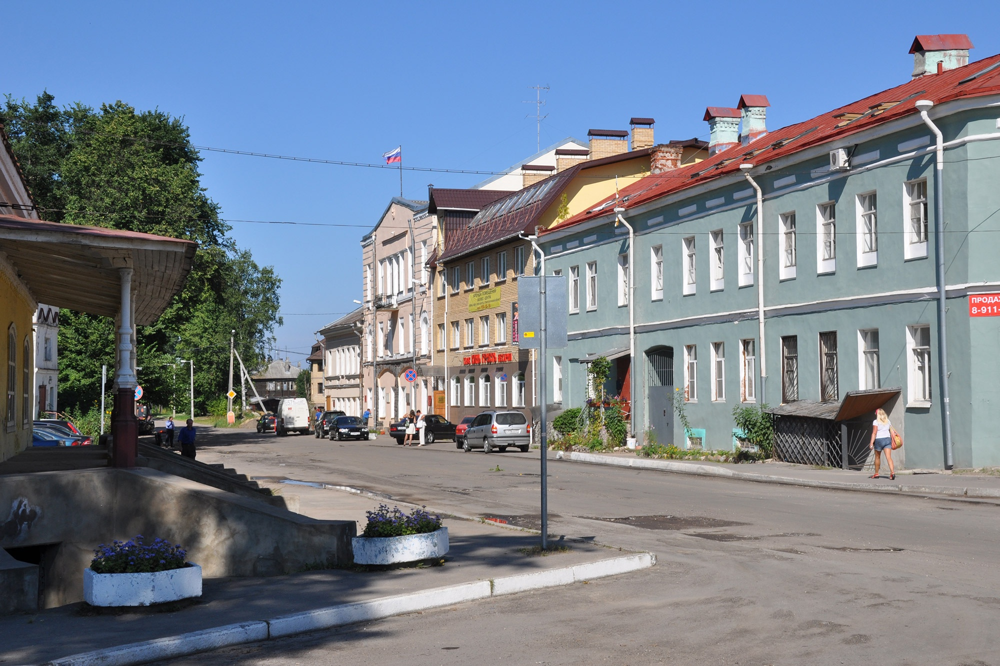
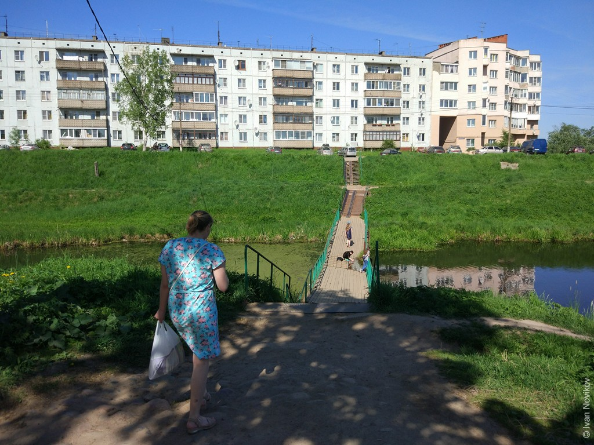
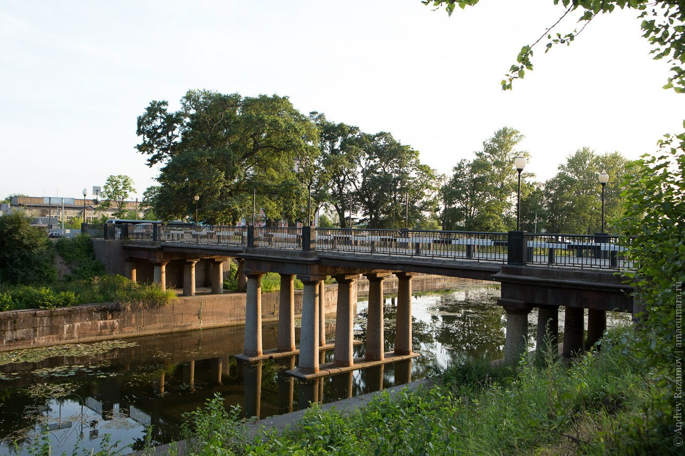
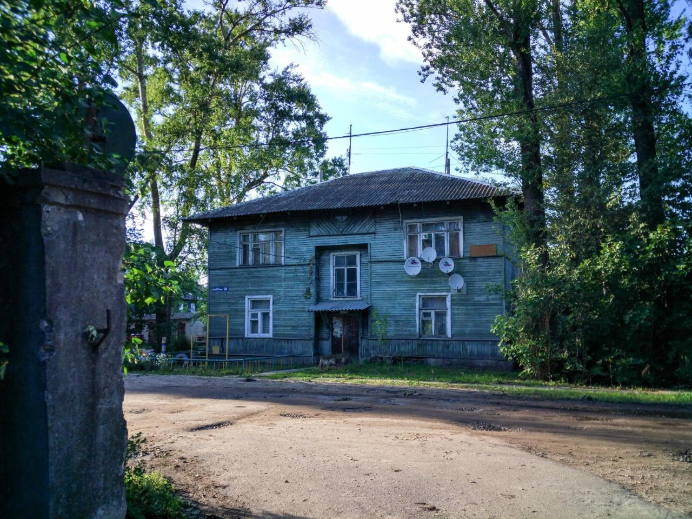
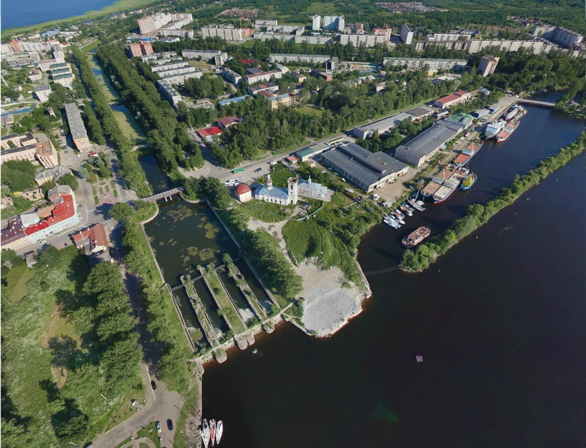

Производим аварийное вскрытие замков дверей, сейфов, автомобилей в Шлиссельбурге (Кировский район Ленинградской области.) 

Мы оказываем услуги вскрытия замков на выезде. 

В срочном порядке прибываем на заказ в Кировский района также соседние районы СПб и ЛО. 

Кроме открывания замков дверей, мы осуществляем ремонт, замену, установку дверных замков.



А также, ремонтируем автомобильные и сейфовые замки на выезде.

### Вскрытие дверей в Шлиссельбурге

Наш специалист ежедневно на дежурстве, чтобы помочь Вам срочно вскрыть дверь в Шлиссельбурге (Кировский район). Произведем вскрытие двери при утере ключа, неисправности замка или при закрытой задвижке (ночном стороже). 



Откроем любую дверь Вашей квартиры, дома или гаража не зависимо от сложности замка и сложившейся внештатной ситуации. Успешно вскрываем металлические и деревянные двери, ворота, решетки, не повреждая их.

### Вскрытие автомобилей в Шлиссельбурге

Оперативно приедем к Вам на помощь вскрыть авто в Шлиссельбурге и соседних поселках района. Откроем любую машину, иномарку и отечественную, легковую и грузовую. Решаем задачу с заблокированными замками машины, севшим АКБ, неисправностью центрального замка. 



Вскроем замок дополнительного оборудования (рейлинги, автобагажник, замок кпп или капота). Работаем аккуратно, без повреждений лкп, замков и стекол.

### Вскрытие сейфов в Шлиссельбурге

У Вас случилась проблема с сейфом? Потерялся ключ или не открывается кодовый замок? Обращайтесь, поможем. Мы откроем сейф в Шлиссельбурге, выезжая в самые кротчайшие сроки. Вскроем любой домашний, офисный или банковский сейф, металлический ящик или шкаф, платежный терминал или банкомат. 



Произведем вскрытие сейфа, профилактику, качественный ремонт или замену сейфового замка.

### Ремонт, замена, установка замков в городе Шлиссельбург

Наша служба производит ремонт дверных замков, замену и установку замков на двери любых типов в Шлиссельбурге, Кировском районе и любом соседнем районе. Если требуется, заменим цилиндровый механизм замка, кодовый ротор, нуклео, корпус, фалевые ручки и другую фурнитуру. 

Перекодируем замок на новый комплект ключей (при наличии такой опции). Проведем профилактические и регулировочные работы по запорным механизмам (ригелям) замков.
