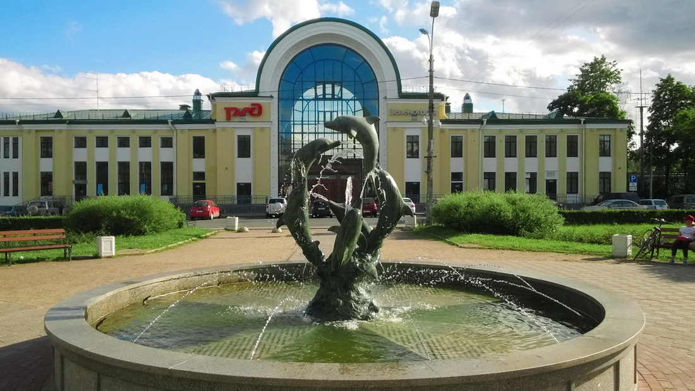
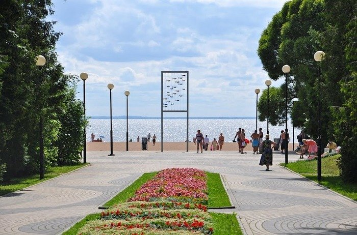

Поможем вскрыть замок двери автомобиля, сейфа – Зеленогорск, Рощино, Молодежное, Репино

### Вскрытие дверей в Зеленогорске

При возникновении проблем с замком или ключом, мы поможем Вам вскрыть дверь в Зеленогорске. 



Вскрываем двери квартир, частных домов, офисов, гаражей и прочих помещений, приезжая по заявке в самые сжатые сроки. 



Быстро вскроем Вашу дверь, отремонтируем замок (если необходимо), заменим или установим новый. В своей работе мы используем только аккуратные способы вскрытия замков.

### Вскрытие автомобилей в Зеленогорске

У Вас заблокировался заведенный автомобиль? Машина закрылась, а ключ остался внутри? Или разрядился аккумулятор от долгого простоя авто? 



Не зависимо от того, какой авто нужно вскрыть в Зеленогорске, мы готовы срочно приехать по Вашей заявке. Откроем дверь салона, капот или багажник автомобиля без повреждений. 

Поможем вскрыть автомобиль, а также замки рейлингов, автобагажников, а также мотозамки, кофры, замки бензобаков. Разблокируем любые механические противоугонные замки.

### Вскрытие сейфов в Зеленогорске

Такую деликатную услугу, как вскрытие сейфа мы оказываем с особым подходом, т.к. эта процедура не терпит вмешательства дилетантов. 



Мы работаем высокоточным инструментом, требующим определенных навыков пользования. Для того, чтобы аккуратно открыть сейф необходимо знать устройство замка, механизма и его защитные свойства. 

Также важно уметь анализировать и устранять всевозможные неисправности, и сбои в работе замка сейфа. Мы вскроем любой сейф, металлический ящик или шкаф, с гарантией сохранности его содержимого.

### Установка замков в Зеленогорске



Мы предлагаем услуги по ремонту замков, замене и установке дверных замков, обслуживая на выезде город Зеленогорск и весь Курортный район а также соседние районы (Зеленогорск, Рощино, Первомайское, Молодежное, Репино, Приветнинское, Комарово, Ленинское, Солнечное, Решетниково, Ушково, Смолячково, Семиозерье, Цвелодубово, Коробицыно, Правдино). 

Заменим цилиндр замка, нуклео, ротор или корпус замка, сделаем подгонку, регулировку замка, расточим ответную часть коробки двери (если необходимо). У Вас сломался замок на двери или хотите поставить дополнительный? Звоните, постараемся помочь. 

Наш специалист в Вашем районе готов приехать по договоренности в любую точку района и провести осмотр двери, замка. После согласования всех нюансов мероприятия, мастер сразу приступает к работе.