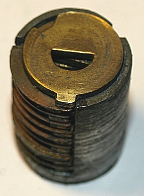
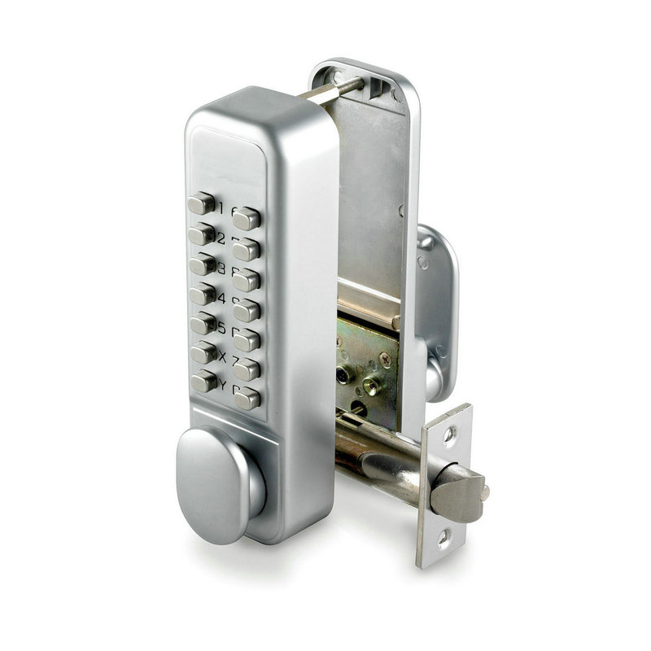
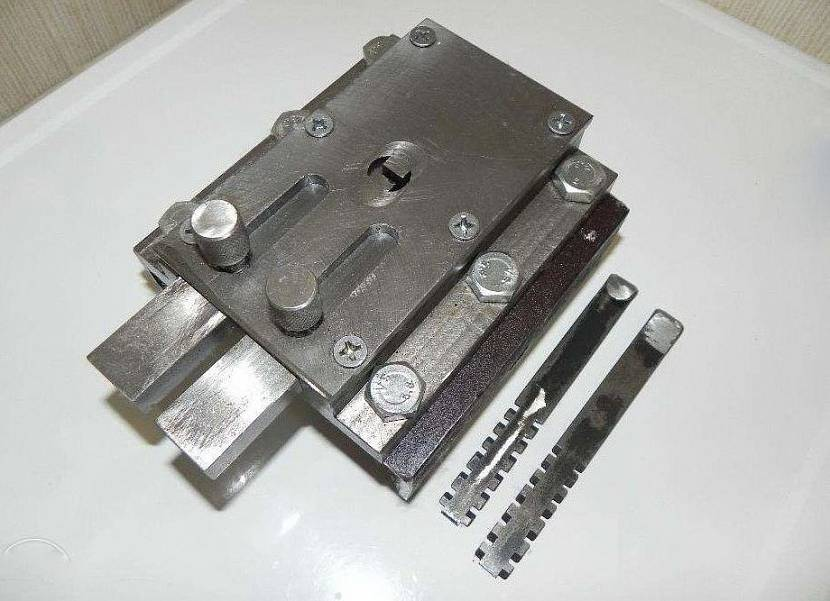
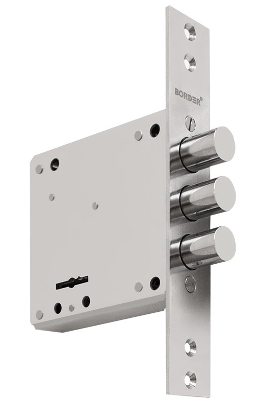
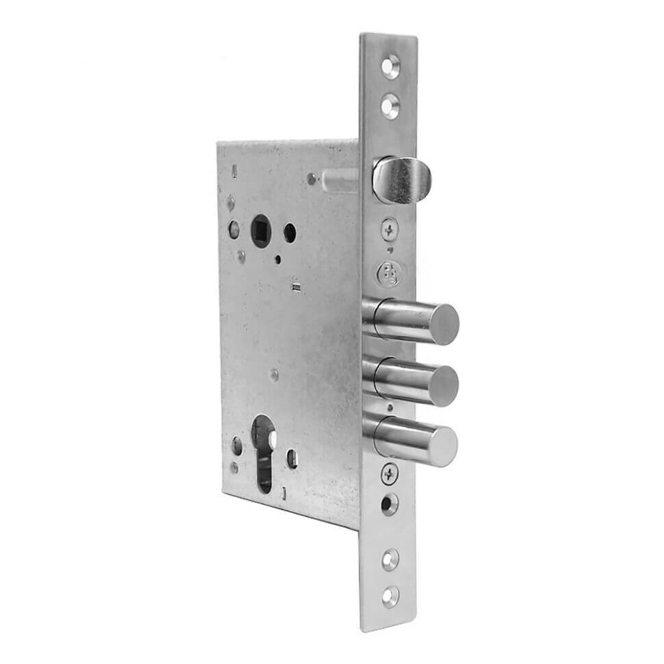
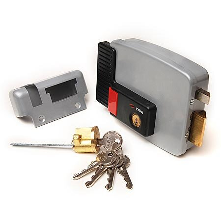

## И основные типы замочных механизмов

### Дисковый

 
Механизм открывания в виде цилиндра с дисками. Как правило эти замки могут сами захлопываться без участия ключа.

### Кодовый

 
Отпирается кодовыми комбинациями. Обычно стоят на сейфах.

### Реечный 

Как правило, два подпружиненных ригеля (иногда один). Открываются надавливанием ключа либо вытягиванием на себя. Не очень безопасные замки.

### Сувальдный  

Механизм с сувальдными пластинами. Тоже очень популярный. Безопасный и взломостойкий.

### Цилиндровый 

Очень распространенный механизм. В роли механизма запирания выступает цилиндр (личинка).

### Электромеханический 

Работает от электрической энергии. Открывается кодовыми комбинациями или магнитными ключами.
