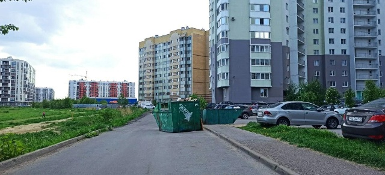
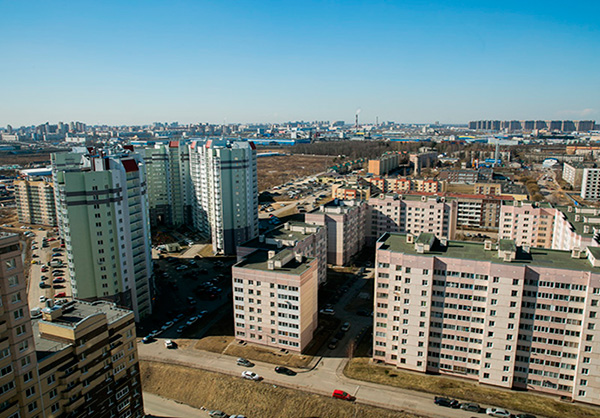

### Установка замков в Буграх: качественно и надежно

Владение собственным жильем — это большая ответственность. Новый замок может обеспечить дополнительную защиту вашего дома или квартиры. Мы предлагаем услуги по установке замков на высшем уровне, обеспечивая ваше спокойствие и безопасность.



**Что мы предлагаем:**

- Опыт установки замков любой сложности: от обычных дверных замков до сейфов и гаражных ворот.
- Работы выполняются качественно и без повреждений имущества.
- Мы используем только профессиональный инструмент и материалы.
- Гибкая ценовая политика, а также индивидуальный подход к каждому клиенту.

### Профессиональные услуги установки замков:

Будь то установка нового замка или замена существующего, мы гарантируем высокое качество работ. Мы специализируемся на замках ведущих брендов, таких как Форпост, Цербер, Барьер и других.



**Контакты:**

Чтобы узнать больше о наших услугах или записаться на установку замков, звоните по номеру +7(921)940-50-94. Вы также можете отправить фото или видео на WhatsApp или Telegram для консультации и оценки ситуации. Наши специалисты всегда готовы помочь вам обеспечить безопасность вашего жилья.
