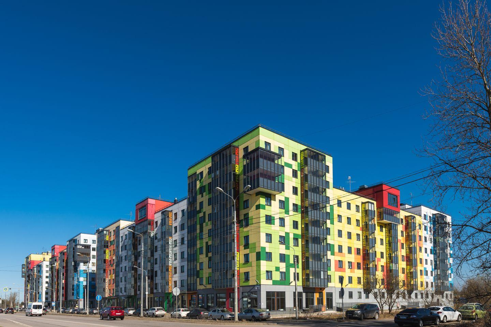

### Ремонт, замена, установка замков в Гатчине

Мы специализируемся на ремонте, замене и установке замков в городе Гатчина, Коммунар Гатчинского района Ленинградской области. Наша служба предоставляет широкий спектр услуг, связанных с обеспечением безопасности вашего жилья или офиса.

Мы предлагаем следующие услуги:

- **Ремонт замков:** Наши мастера осуществляют ремонт замков любой сложности. Мы проведем замену цилиндра, нуклео, ротора или корпуса замка, выполним подгонку и регулировку, а также расточим ответную часть коробки двери, если это необходимо.

- **Замена замков:** Предлагаем замену и установку новых замков на двери вашего дома или офиса. Мы работаем с различными типами замков и гарантируем качество и надежность установленных механизмов.

Наши специалисты готовы приехать к вам в любое удобное время и место в городе Гатчина, Коммунар. После осмотра двери и согласования всех деталей, мы оперативно приступаем к работе.

Доверьте ремонт, замену и установку замков профессионалам, и вы получите надежные и безопасные механизмы для вашей защиты.

Местонахождение нашей компании: Гатчина, Коммунар, Гатчинский район, Ленинградская область.