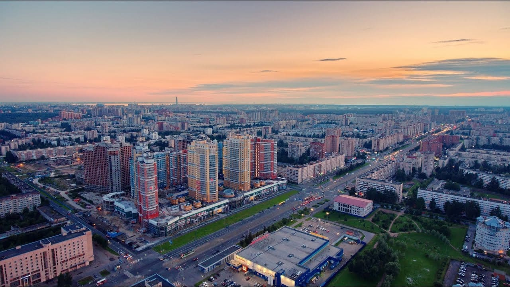

Установка и замена замков в Калининском районе
Мы специализируемся на профессиональной установке и замене замков в Калининском районе. Наша команда мастеров готова выполнить работы любой сложности, обеспечивая безопасность и надежность установленных механизмов.



Установка замков в Калининском районе

Мы предлагаем следующие услуги:

**Установка замков:** Мы осуществляем установку замков на различные виды дверей - металлические, деревянные, металлопластиковые. Наши мастера гарантируют качественное выполнение работ и оперативность в обслуживании.

**Замена замков и комплектующих:** Мы предлагаем замену замков, ручек, цилиндров, роторов и других комплектующих. В нашем ассортименте всегда в наличии замки популярных брендов, готовые к установке или замене по вашему выбору.

Наши мастера готовы приехать к вам в день обращения и выполнить работы по установке или замене замков. Мы также работаем по предварительной договорённости, чтобы удовлетворить ваши потребности в удобное для вас время.



Доверьте установку и замену замков профессионалам, и вы получите надежные и безопасные механизмы для вашей защиты.

Местонахождение нашей компании:
М. Гражданский пр., Академическая, Политехническая, пл. Мужества, пл. Ленина