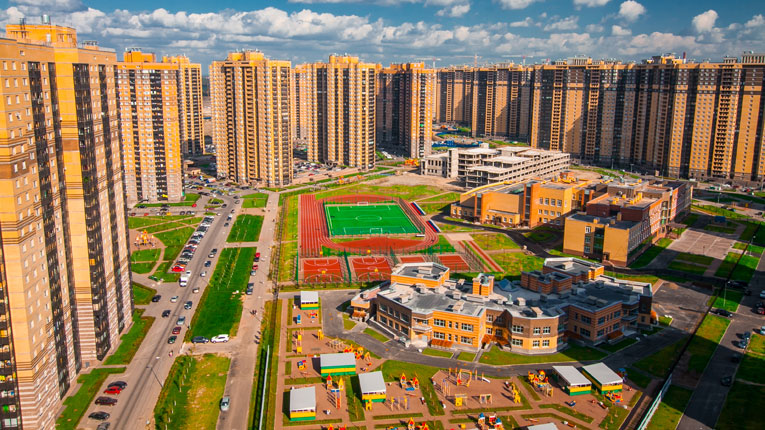
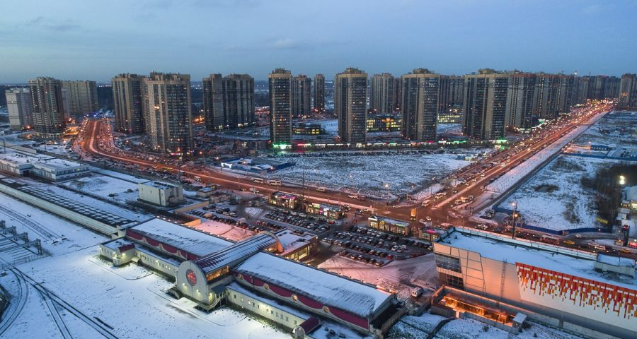
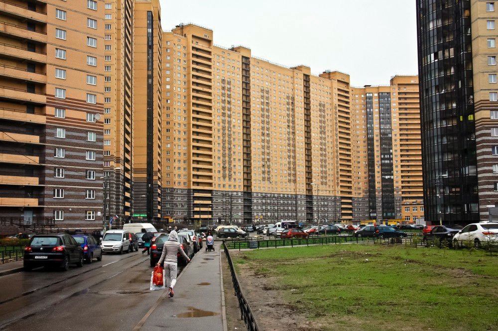
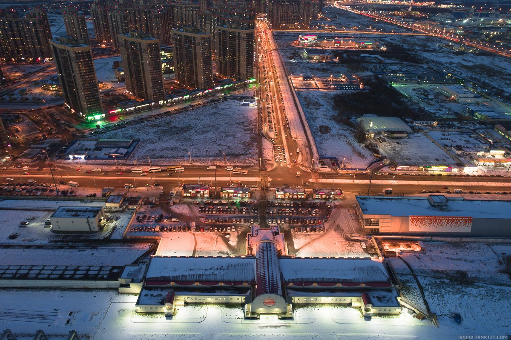

На Парнасе мы специализируемся на установке, ремонте и замене замков, обеспечивая высококачественные услуги для жителей этого района. Наша команда обученных специалистов готова оказать помощь в различных ситуациях, связанных с замками. Мы работаем на территории всего района, в том числе в ЖК Континенты и в ЖК Северная Долина.



### Установка новых замков

Если вы хотите установить новый замок на вашей двери, будь то в квартире, офисе или частном доме, мы предоставляем услуги по его установке. Наши мастера имеют опыт работы с различными типами замков на металлических, деревянных и металлопластиковых дверях. Мы также можем заменить старые замки полностью или частично с заменой кодового элемента.

### Ремонт замков

Если ваш замок сломался или начал давать сбои, наши специалисты могут провести ремонт на месте. Мы занимаемся заменой цилиндра замка, нуклео, ротора или корпуса замка, а также выполним подгонку и регулировку замка по необходимости.

### Вскрытие замков

В случае, если вы оказались перед запертой дверью из-за утери ключей или других обстоятельств, мы можем помочь вам без повреждения двери. Наши мастера обладают необходимыми навыками и инструментами для аккуратного вскрытия дверей в квартирах, офисах, частных домах или гаражах.

### Срочная помощь

Наша служба готова приехать на помощь вам в любой точке района Парнас по согласованию. Мы работаем оперативно и профессионально, обеспечивая безопасность и надежность наших услуг.

Если вам нужна помощь с установкой, ремонтом или вскрытием замков, не стесняйтесь обращаться к нам. Наша команда готова помочь вам в любой ситуации.

