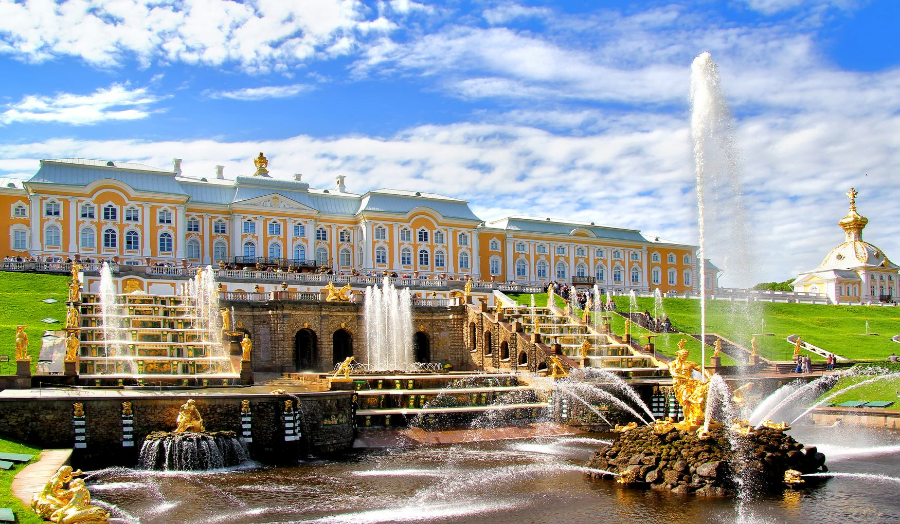
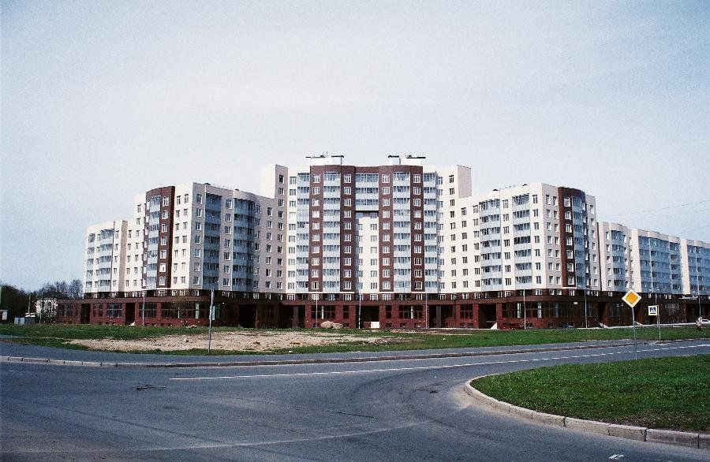

Выполняем установку замков на дверях, сейфах и других объектах в городе Петергоф, Ломоносов, Стрельна, Петродворец, Красное село, Гостилицы, Ропша и смежных районах.

Приезжаем быстро по вашему звонку, чтобы помочь с установкой замка любой сложности. Гарантируем безопасность вашей двери и имущества.



Выполним замену замка или кодового механизма, а также установим замок на новом месте. Проведем ремонт замка или сейфа.

### Установка замков в Петергофе

Мы стремимся улучшить оперативность предоставления услуг по установке замков в Петродворцовом районе: на входных и межкомнатных дверях, в гаражах и на роллетах, с гарантией качества и мастерства.



Мы готовы качественно установить замок на дверь любого типа: металлическую, деревянную или металлопластиковую, даже с самыми сложными механизмами. Мы аккуратно устанавливаем замки на квартирных дверях, в частных домах, гаражах и других помещениях.

### Установка сейфов в Петергофе

С особым вниманием относимся к установке сейфов в Петергофе. Мы готовы качественно установить любой сейф: домашний, офисный или банковский, независимо от его назначения и класса взломостойкости.



Мы можем установить сейф с механическим (ключом, кодовым замком) или электронным (с сенсорным управлением) замком. Наши специалисты работают с высокоточным инструментом, поэтому вы можете не беспокоиться о сохранности содержимого сейфа.

### Заключение

Мы готовы выполнить качественную установку, замену или ремонт замков в Петергофе, Ломоносове, Стрельне, Петродворце, Красном селе, Гостилицах, Ропше и других близлежащих городах и районах. Обращайтесь к нам для перекодировки, замены цилиндров или роторов в замках.