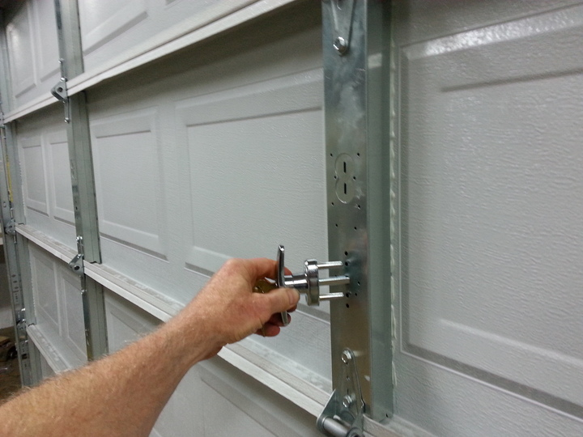

### Установка замков в Пушкине

В городах Пушкин, Павловск, Коммунар, Шушары, Колпино и других соседних населенных пунктах мы предлагаем профессиональные услуги по установке замков любой сложности. Независимо от типа замка и количества, мы гарантируем быстрое и качественное выполнение работ.

Мы осуществляем установку замков на двери квартир, офисов, гаражей и других помещений. Наши специалисты готовы работать с различными типами замков, включая цилиндровые, сувальдные, дисковые и роторные. Независимо от материала вашей двери - дерево или металл с усиленной защитой - мы подберем оптимальное решение для вашей ситуации.

Мы также предлагаем услуги замены компонентов замков, таких как цилиндры, роторы, нуклии, ручки, накладки и броненакладки. Помимо этого, мы проводим профилактические работы над механизмами замков, чтобы обеспечить их надежную работу на долгий срок.

Наши специалисты обладают необходимым опытом и инструментами для выполнения работ по установке замков любой сложности. Мы стремимся обеспечить наших клиентов качественными услугами и максимальным уровнем удовлетворенности.

Если вам требуется установка или замена замков в Пушкине или его окрестностях, обращайтесь к нам - мы готовы помочь вам в этом важном вопросе.