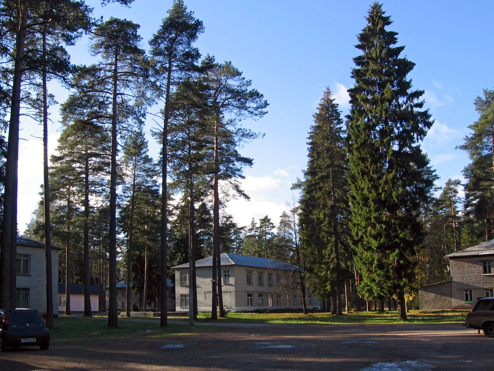
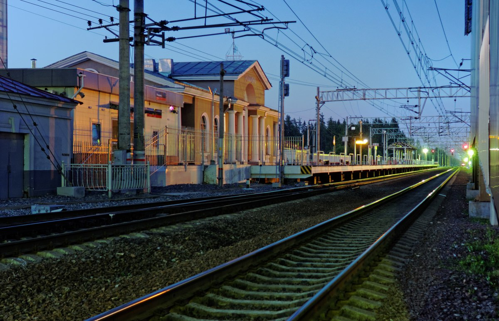
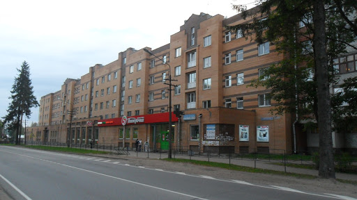
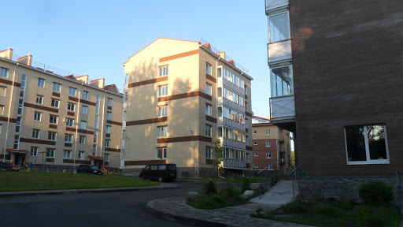

Мы специализируемся на установке, замене и ремонте замков в поселке Рощино Выборгского района Ленинградской области, а также в Лебяжье, Ушково, Молодежном и Первомайском.



### Профессиональная установка замков

Наша команда профессионалов предоставляет качественные услуги по установке замков с гарантией на все выполненные работы. Мы осуществляем установку различных типов замков, включая:

- Входные замки
- Межкомнатные замки
- Гаражные замки
- Роллетные замки

### Широкий выбор замков

Мы предлагаем широкий выбор замков различных типов и моделей, чтобы удовлетворить потребности каждого клиента. В нашем ассортименте вы найдете замки для металлических, деревянных и металлопластиковых дверей. 

### Профессиональный подход к установке

Наши специалисты обладают опытом и навыками для профессиональной установки замков любой сложности. Мы гарантируем качественное выполнение работ и долгосрочную надежность установленных замков.

### Установка дополнительных механизмов

Помимо основной установки замков, мы также предоставляем услуги по установке дополнительных механизмов, таких как:

- Цилиндры
- Роторы
- Нуклеи

Мы гарантируем высокое качество и надежность всех установленных компонентов.



### Обслуживание и гарантия

После установки замков мы также предоставляем обслуживание и гарантийное обслуживание. Наши специалисты всегда готовы помочь вам с любыми вопросами или проблемами, связанными с установленными замками.

### Заключение

Если вам требуется профессиональная установка замков в поселке Рощино или соседних районах, обратитесь к нам. Мы гарантируем качество, надежность и оперативность в выполнении всех работ по установке и замене замков.

