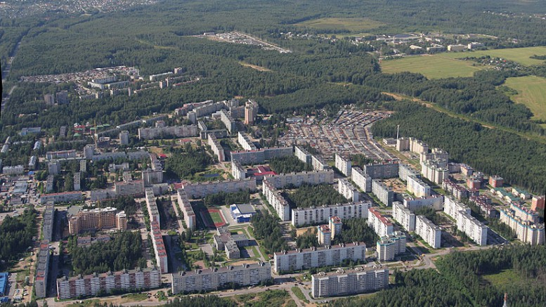
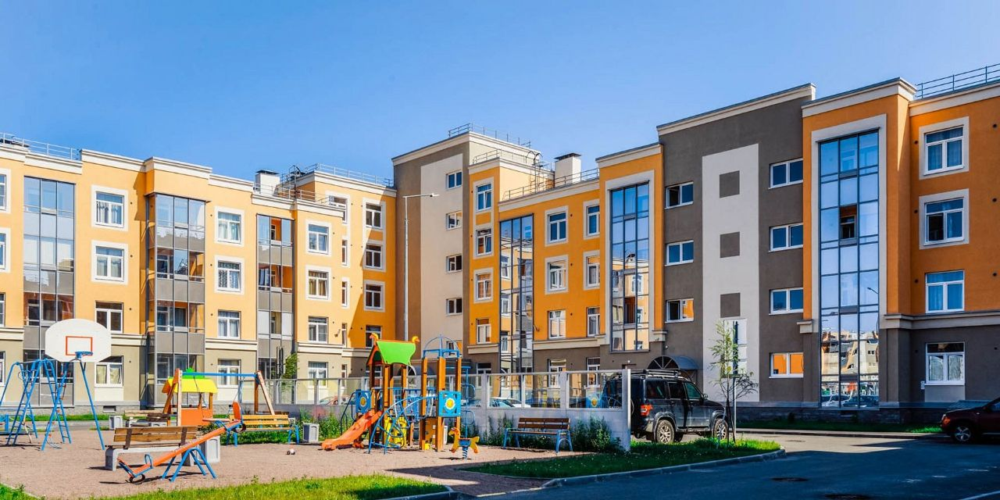
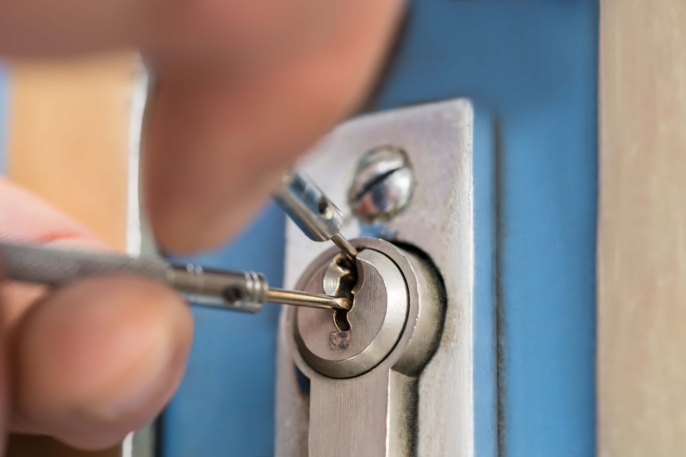
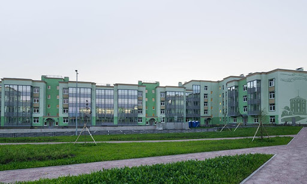

Поможем в установке замков в Сертолово и всем Всеволожском районе. Оперативно и по лучшей цене!

Мы специализируемся на установке замков дверей в Сертолово и окрестностях. 



По вашему звонку приедем и поможем установить замок в Сертолово, Парголово, Песочный, Юкки. 



Мы устанавливаем замки любой сложности и типов. Оказываем услуги установки замков, выезжая по всему Всеволожскому району Ленинградской области (Лесколово, Осельки, Гарболово, Грузино, Елизаветинка, Ириновка, Дубровка, Кавголово, Керро, Корабсельки, Матокса, Озерки, Порошкино, Разметелево, Стеклянный, Сярьги, Черная речка, Энколово). 



Кроме установки, производим ремонт и замену дверных замков в Сертолово.

### Установка замков на дверях в Сертолово

В нашей службе каждый день на дежурстве мастер, если нужна помощь по установке замков на дверях в Сертолово и во всем Всеволожском районе. Имеем все необходимые инструменты и приспособления для оказания качественного сервиса. 



Мы сможем аккуратно установить замок на дверь вашей квартиры, офиса, частного дома или гаража. При необходимости отремонтируем или заменим неисправный замок сразу на месте. Устанавливаем замки на металлических, деревянных и металлопластиковых дверях.

### Ремонт, замена, установка замков в Сертолово

Мы предлагаем услуги по ремонту замков, замене и установке дверных замков, обслуживая на выезде город Сертолово и весь Всеволожский район Ленинградской области. 

Заменим цилиндр замка, нуклео, ротор или корпус замка, сделаем подгонку, регулировку замка, расточим ответную часть коробки двери (если необходимо). У вас сломался замок на двери или хотите поставить дополнительный? 

Звоните, постараемся помочь. Наш специалист в вашем районе готов приехать по договоренности в любую точку района и провести осмотр двери, замка. После согласования всех нюансов мероприятия, мастер сразу приступает к работе.