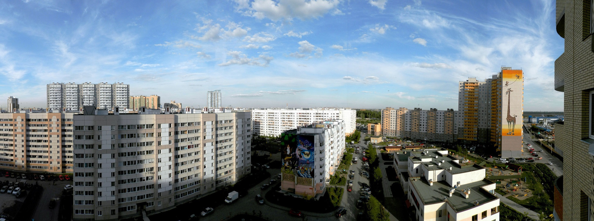
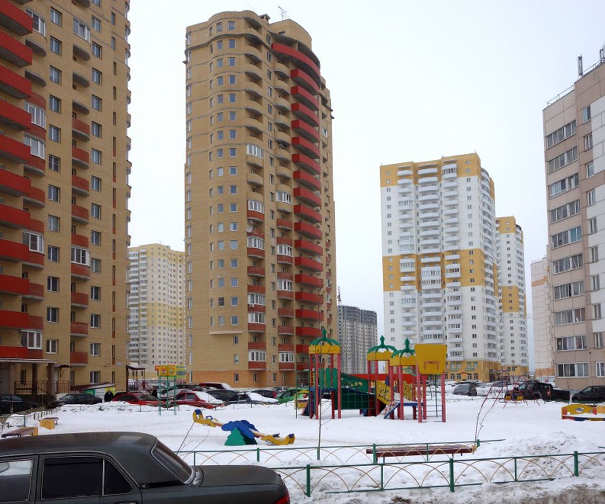

Мы специализируемся на установке и обслуживании дверных замков в поселке Шушары Пушкинского района и соседних районах. Наша команда оперативно реагирует на заявки и выезжает по вызову, чтобы помочь в установке и настройке замков. 



Наши услуги включают не только установку новых замков, но и замену цилиндров, перекодировку под новые ключи и замену роторов. Мы также осуществляем установку замков на новые места с профессиональным подходом. 

Независимо от сложности замка или типа двери, мы готовы помочь. Мы специализируемся на открытии различных типов замков, включая цилиндровые, сувальдные, дисковые и роторные замки. У нас есть опыт работы с деревянными и металлическими дверями, включая те, что имеют усиленную защиту.

Наша команда использует только аккуратные методы открытия замков, чтобы избежать повреждений. Мы гарантируем профессиональное и бережное открытие дверей без вреда для вашей собственности.



Если у вас есть потребность в установке нового замка или замене старого, не стесняйтесь обращаться к нам. Мы готовы ответить на ваши вопросы и предложить оптимальное решение для ваших потребностей. Наш опытный специалист готов приехать по договоренности в удобное для вас время и провести необходимые работы по установке или замене замков на вашей двери.


