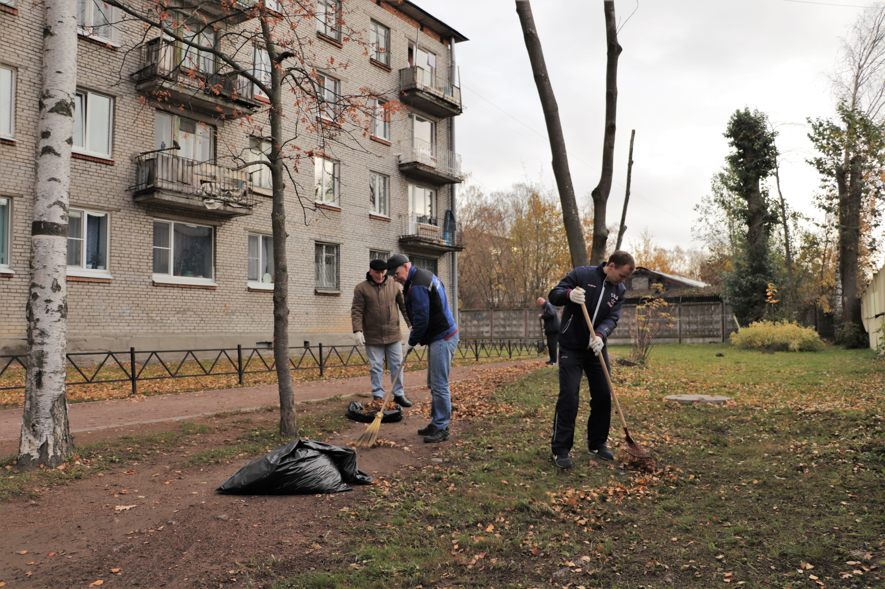
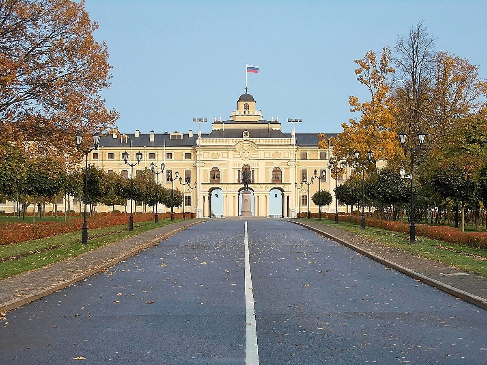
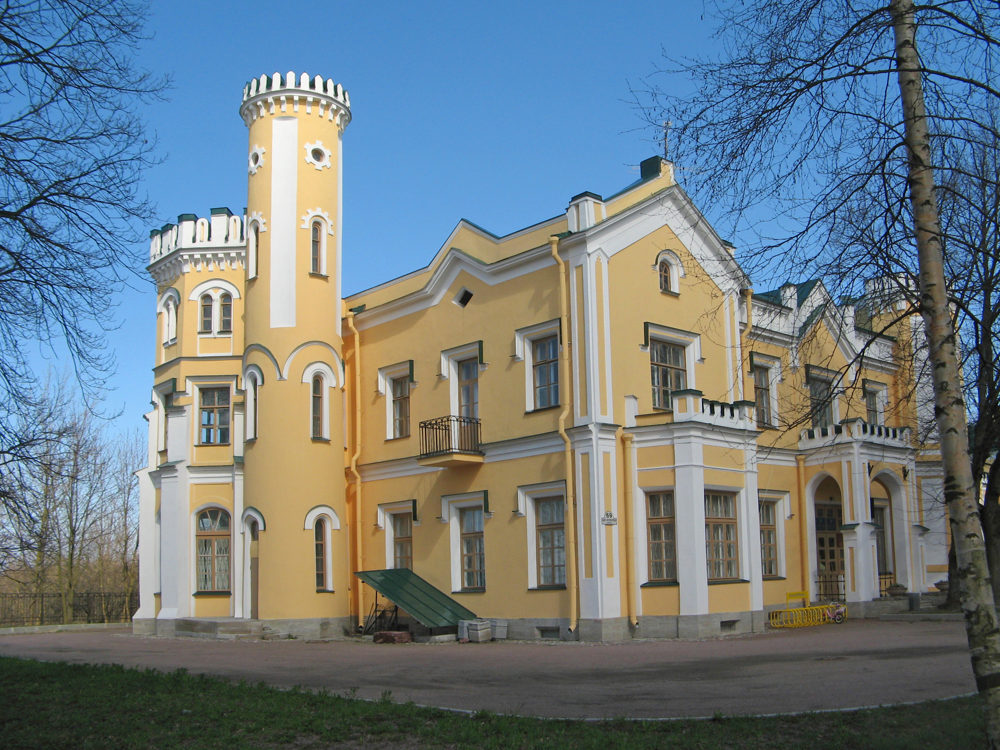

Установка и замена замков в поселке Стрельна Петродворцового района города Санкт-Петербурга - это процесс, который требует профессионализма и надежности. Мы специализируемся именно на этом виде услуг и готовы предложить широкий спектр работ по установке и замене замков различной сложности.



### Профессиональная установка замков

Мы обеспечиваем качественную установку замков на двери любых типов и конструкций. Независимо от того, является ли ваша дверь деревянной или металлической, у нас есть опыт и навыки для установки замков на любую из них. Мы заботимся о безопасности вашего жилища или офиса и гарантируем, что установленные нами замки будут исправно функционировать и обеспечат надежную защиту.

### Виды замков, которые мы устанавливаем

Мы работаем с широким спектром замков, включая цилиндровые, сувальдные, дисковые, роторные и другие типы. Независимо от сложности механизма замка, наши специалисты обладают необходимыми навыками и инструментами для его установки. Мы также готовы предложить консультацию по выбору наиболее подходящего типа замка в зависимости от ваших потребностей и условий эксплуатации.

### Замена и обслуживание замков

В случае необходимости замены замка или его элементов, мы также готовы предложить свои услуги. Мы осуществляем замену цилиндров, роторов, нуклиев, ручек, накладок, броненакладок и других компонентов замков. Кроме того, мы предлагаем профилактическое обслуживание замков, которое позволяет поддерживать их работоспособность на высоком уровне.



### Преимущества работы с нами

Выбирая наши услуги по установке и замене замков, вы можете быть уверены в получении следующих преимуществ:

- Профессионализм и опыт наших специалистов.
- Использование качественных материалов и инструментов.
- Индивидуальный подход к каждому клиенту и его потребностям.
- Гарантия качества выполненных работ.

Мы ценим доверие наших клиентов и стремимся к тому, чтобы каждая установленная или замененная нами дверная блокировка обеспечивала надежную защиту и комфорт в повседневной жизни.