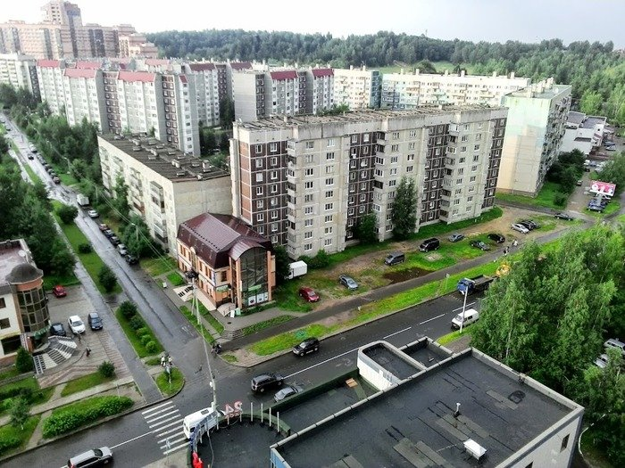
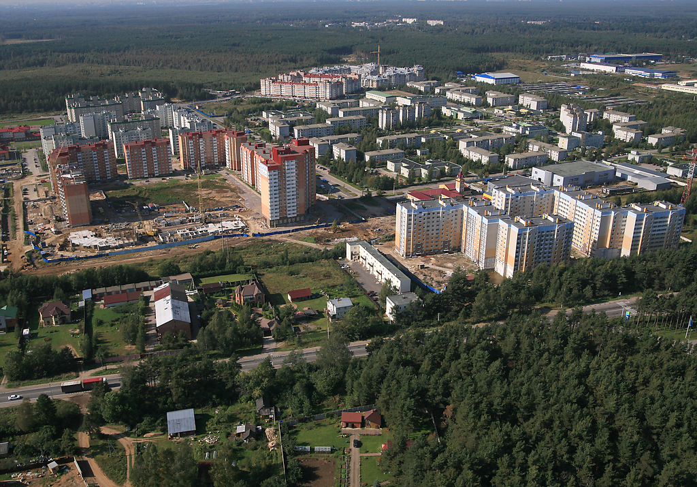
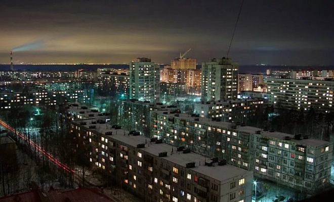
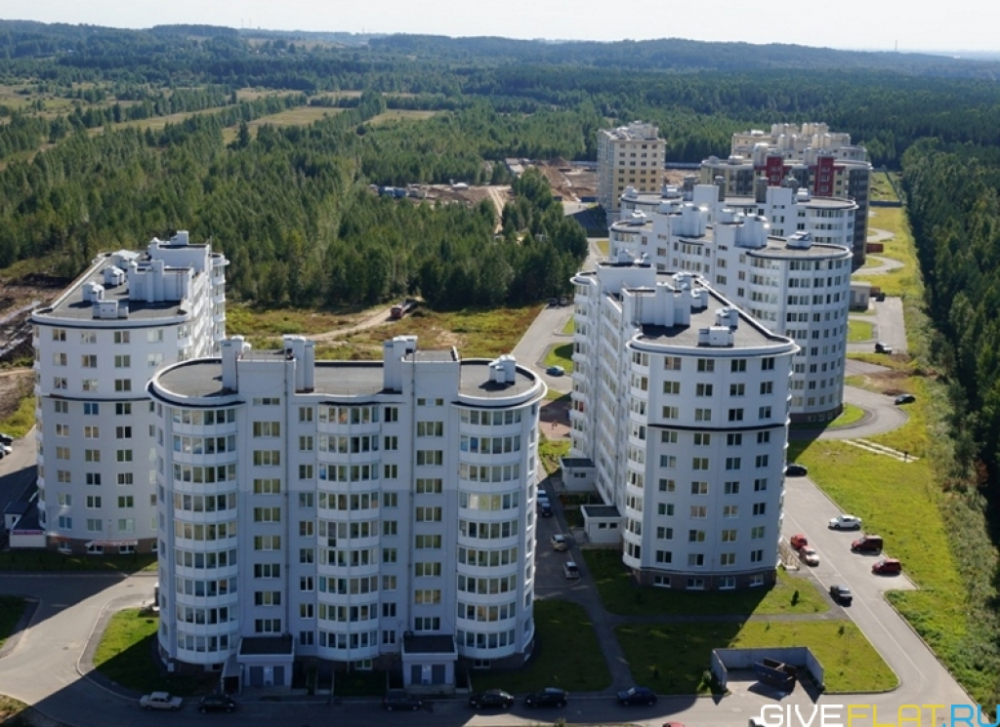

Мы специализируемся на установке замков в двери, обеспечивая безопасность вашего дома или офиса во Всеволожске и прилегающих районах. Наша команда обеспечивает профессиональную установку различных типов замков с гарантией качества и надежности.



### Услуги по установке замков

Мы предлагаем широкий спектр услуг по установке замков, включая:

**1. Установка дверных замков**

Наша команда квалифицированных мастеров проведет установку дверных замков любой сложности. Мы работаем как с металлическими, так и с деревянными дверями, обеспечивая идеальную посадку замков и их бесперебойную работу.

**2. Замена замков**

При необходимости замены старых или поврежденных замков, мы предоставляем услуги по быстрой и качественной замене. Наши специалисты помогут вам выбрать подходящий замок и произведут его замену без повреждения двери.

**3. Ремонт замков**

Если ваш замок требует ремонта из-за поломки или неисправности, наши опытные мастера быстро и эффективно восстановят его работоспособность. Мы осуществляем замену деталей, регулировку и любой другой необходимый ремонт.

### Профессиональная установка с гарантией

Мы гарантируем качество и надежность каждой установленной нами дверной блокировки. Наши специалисты имеют обширный опыт работы с различными типами замков и оборудованием, что позволяет нам обеспечить высокий уровень сервиса.



### Обслуживание на высшем уровне

Мы стремимся предоставить нашим клиентам наилучший сервис, поэтому оперативно реагируем на все запросы. Наша служба работает круглосуточно, чтобы вы могли быть уверены в том, что получите помощь в любое время дня и ночи.

### Контактная информация

Для заказа установки замков или получения консультации вы можете связаться с нами по телефону или заполнить форму на нашем сайте. Наши специалисты ответят на все ваши вопросы и помогут подобрать оптимальное решение для ваших потребностей в безопасности.

### Заключение

Надежные замки - это важная составляющая безопасности вашего дома или бизнеса. Доверьте установку замков профессионалам, и вы сможете спокойно наслаждаться жизнью, зная, что ваше имущество защищено надежными замками.
