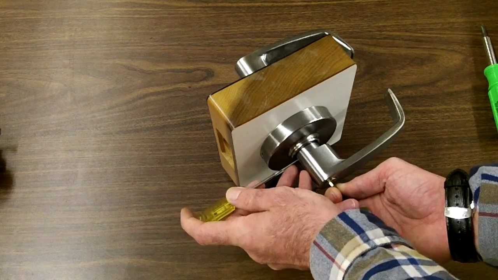

Наша компания предлагает профессиональные услуги по **вскрытию и установке замков Барьер** в Санкт-Петербурге. Замки Барьер, известные своей надежностью, иногда требуют ремонта или замены. Мы гарантируем оперативное решение проблем с замками любой сложности.

Когда ваш замок заклинил или сломался, наши опытные мастера быстро и аккуратно произведут **вскрытие замка Барьер** и предложат профессиональную **установку нового замка**.

Вы можете выбрать замок той же марки – Барьер, либо заменить его на замок другого производителя, соответствующий вашим требованиям безопасности и бюджету.



Услуги по **вскрытию и замене замков** могут потребоваться в различных ситуациях: утеря ключей, их поломка или кража, а также естественный износ механизма входной двери.

Мы также предлагаем услуги по **вскрытию и замене замков** в межкомнатных дверях.



Наши специалисты выезжают на объекты любой сложности: жилые дома, офисы, торговые центры, склады, гаражи и другие помещения в Санкт-Петербурге, где требуется профессиональное **вскрытие или установка замка**.

**Вскрытие замков** производится аккуратно, без повреждения двери и имущества. Мы используем профессиональный инструмент и современные методики.

Мы работаем со всеми типами замков, включая накладные, врезные, электронные и кодовые.

### Вскрытие замков Барьер в Санкт-Петербурге

Методика **вскрытия замка Барьер** зависит от его типа и конструкции. Наши мастера обладают необходимыми знаниями и опытом для быстрого и эффективного решения проблемы.



Сувальдные замки, такие как замки Барьер, имеют сложную конструкцию с металлическими пластинами (сувальдами). Для **вскрытия сувальдного замка** может потребоваться специальный инструмент, такой как наборной ключ или декодер.

Ключ для сувальдного замка имеет зазубрины, которые взаимодействуют с сувальдами.

В зависимости от модели замка Барьер, может потребоваться индивидуальный подход к его **вскрытию**. В крайних случаях, когда другие методы не помогают, мастер может прибегнуть к высверливанию замка или его составных частей.

### Установка замков Барьер в двери

**Установка замка в дверь** требует ответственного подхода, опыта работы с современными замками и знания конструкции дверей.

При **установке замка на входную дверь** особенно важна его надежность и взломостойкость, чтобы обеспечить безопасность вашего имущества.

**Установка замка в межкомнатную дверь** требует выбора надежного и простого механизма, который гармонично впишется в интерьер.

Наши специалисты качественно и профессионально выполнят все необходимые работы по **установке замка Барьер** или его замене. Обращайтесь к нам за профессиональной помощью!