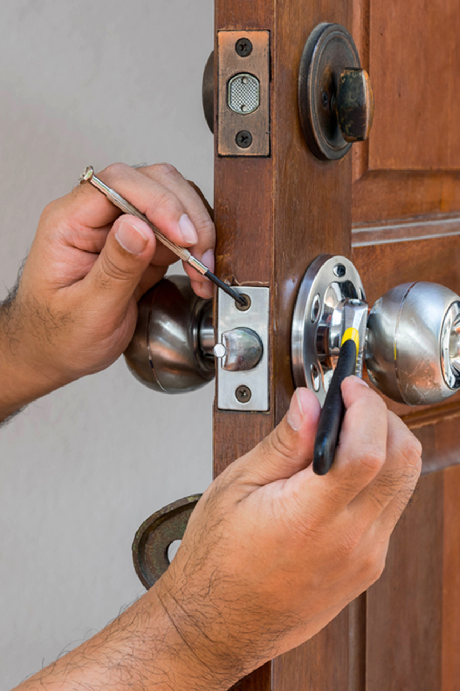

В услуги нашей компании входит вскрытие и установка замков марки Dierre, которые, пусть и надежные, но всё же могут время от времени выходить из строя. 

Когда это происходит, наши мастера смогут открыть заклинивший замок и установить на его место новый.

Он может быть тоже марки Dierre, либо любой другой, которую Вы выберете.



Необходимость такой операции может появиться в самых разных случаях: утеря или поломка, кража ключей, выход замка входной двери из строя. 

В том числе открыть или заменить замок может потребоваться и в межкомнатной двери.



Наши специалисты работают в жилых домах, торговых центрах, офисах, складах, гаражах и любых других помещениях, где необходимо провести вскрытие или установку замка. 

Установка и вскрытие обходится без применения грубой силы и не повредит Ваше имущество.

Наши специалисты умеют работать со всеми типами замков – накладными и врезными, электронными и кодовыми.

### Вскрытие замков

В зависимости от типа замка, может потребоваться разная методика его вскрытия.



Сувальдный замок состоит из металлических пластин, каждая со своей формой и специальным вырезом. 

Ключ для таких замков имеет зазубрины, попадающие в пазы замка и двигающие пластины, что отпирает устройство. 

В таком случае можно прибегнуть к копированию формы ключа с помощью набора штифтов — наборного ключа. 

Может пригодиться декодер или самонаборный ключ.

В зависимости от модели замка Dierre может быть придется индивидуально подходить к устройству. 

В крайнем случае, если замок был изначально повреждён и открыть его с помощью других способов не выходит, мастер может высверлить либо замок, либо его составные части, такие как: хвостовик, засов или ригели.

### Установка замков

Установка замка в дверь предполагает не только ответственный подход, но и опыт работы с оборудованием, а также знание устройства современных дверей и замков. 

Если замок устанавливается на входную дверь, механизм должен быть стойкий и прочный, так как имущество должно быть в постоянно в сохранности. 

Если установка требуется в межкомнатную дверь, то замок должен быть надежный, простой и подходить под интерьер. 

Наши специалисты произведут все необходимые работы для Вас.
