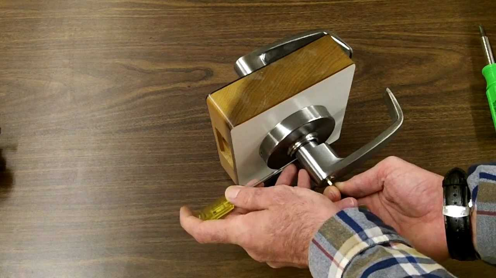

Компания предлагает услуги по **вскрытию замков Гардиан** и их **профессиональной установке в Санкт-Петербурге (СПб)**. Замки Гардиан – известные своей надежностью, но даже они не застрахованы от поломок и износа.

Если ваш замок Гардиан заклинил, сломался или вы потеряли ключи, наши опытные мастера оперативно и аккуратно **вскроют замок** и, при необходимости, предложат **установку нового замка**. 

Мы предлагаем широкий выбор замков, включая замки Гардиан и другие популярные бренды, чтобы удовлетворить любые ваши потребности и бюджет.



Потребность во **вскрытии или замене замка Гардиан** может возникнуть в различных ситуациях: утеря ключей, кража, поломка механизма, износ деталей или необходимость повышения уровня безопасности.

Также мы выполняем **вскрытие и замену замков** в межкомнатных дверях.



Наши специалисты работают с замками Гардиан в квартирах, частных домах, офисах, торговых центрах, складских помещениях, гаражах и других объектах в СПб. Мы гарантируем бережное **вскрытие замков** и **аккуратную установку**, без повреждения вашего имущества.

Мы работаем со всеми типами замков Гардиан: врезными, накладными, сувальдными и цилиндровыми.

### Вскрытие замков Гардиан: особенности и методы

Выбор метода **вскрытия замка Гардиан** зависит от его типа и причины неисправности.



Например, для **вскрытия сувальдного замка Гардиан** может потребоваться использование специальных инструментов, таких как отмычки или декодеры, позволяющих обойти сложный механизм сувальд. Наши мастера имеют большой опыт в **вскрытии сувальдных замков Гардиан** без повреждений.

В каждом случае, к **вскрытию замка Гардиан** мы подходим индивидуально, учитывая особенности его конструкции и степень повреждения. Если другие методы не помогают, в крайнем случае, мастер может аккуратно высверлить замок, чтобы получить доступ к запорным механизмам.

### Установка замков Гардиан: гарантия надежности и безопасности

**Установка замка Гардиан** – ответственная задача, требующая опыта, знаний и использования профессионального инструмента. Наши мастера обладают всеми необходимыми навыками и знаниями для **качественной установки замков Гардиан** в любые двери.

При **установке замка Гардиан на входную дверь** особенно важно обеспечить высокий уровень защиты от взлома. Мы поможем подобрать оптимальную модель замка Гардиан, исходя из ваших требований к безопасности и бюджета.

При **установке замка Гардиан на межкомнатную дверь** мы учтем ваши пожелания к дизайну и функциональности.

Доверьте **вскрытие и установку замков Гардиан** профессионалам! Мы гарантируем качество, оперативность и доступные цены.