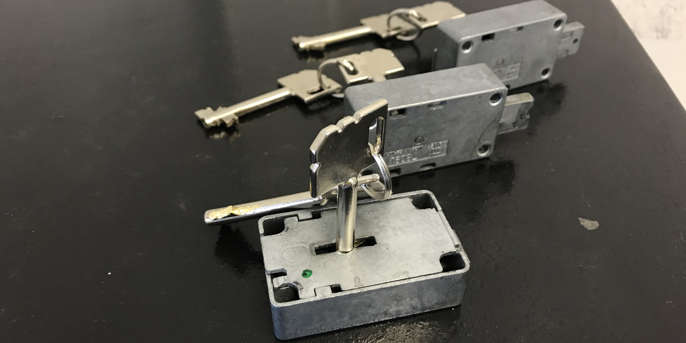
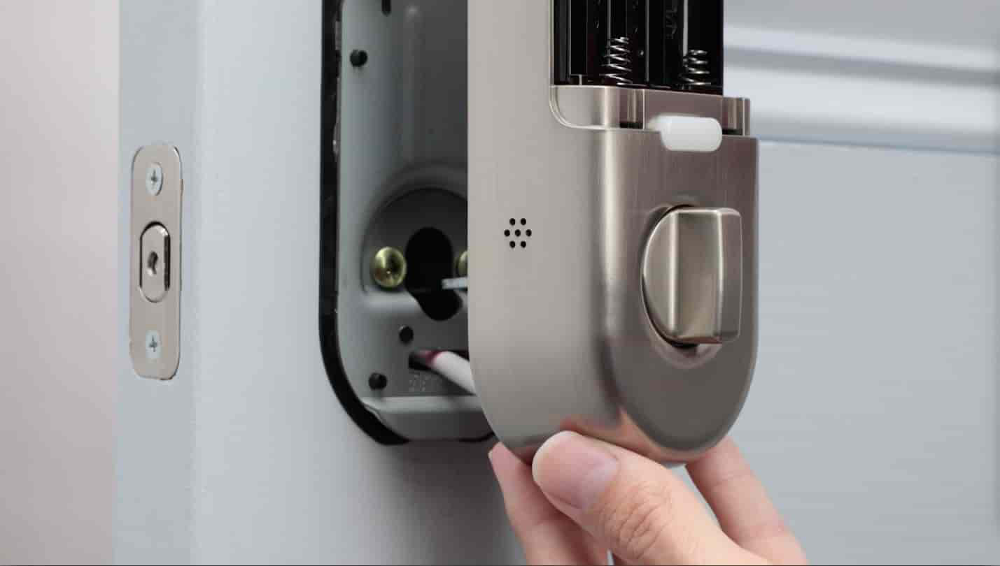

Ищете надежную службу по вскрытию и установке замков Mdm в Санкт-Петербурге? Наша компания предлагает профессиональные услуги по аварийному открытию и замене замков Mdm. Даже самые надежные замки, такие как Mdm, иногда дают сбой. Мы оперативно решим проблему!

Наши опытные мастера аккуратно вскроют заклинивший замок Mdm и профессионально установят новый, выбранный вами. Вы можете выбрать аналогичный замок Mdm или любую другую модель, соответствующую вашим требованиям безопасности и бюджету.



Услуга по вскрытию или замене замка может потребоваться в различных ситуациях: потеря ключей, поломка замка, кража ключей или просто износ механизма входной двери. Мы поможем!

Также мы производим вскрытие и замену замков в межкомнатных дверях.



Наша команда работает в квартирах, частных домах, офисах, торговых центрах, складских помещениях, гаражах и других объектах в Санкт-Петербурге. Мы гарантируем качественное вскрытие и установку замков Mdm без повреждения вашего имущества. 

Наши специалисты имеют опыт работы со всеми типами замков: врезными, накладными, электронными и кодовыми.

### Аварийное Вскрытие Замков Mdm в СПб

Методика вскрытия замка Mdm зависит от его типа и конструкции.



Сувальдные замки Mdm имеют сложный механизм с металлическими пластинами (сувальдами). Открытие такого замка требует профессионального подхода. Мы используем современные инструменты и техники, чтобы аккуратно вскрыть сувальдный замок Mdm.

Для вскрытия сувальдных замков может потребоваться декодер или самонаборный ключ. Наши мастера обладают необходимыми навыками и инструментами.

В зависимости от конкретной модели замка Mdm, наши специалисты подберут оптимальный способ вскрытия. В крайних случаях, когда другие методы не помогают, может потребоваться высверливание замка или его отдельных элементов (хвостовика, засова, ригелей). Это делается максимально аккуратно, чтобы минимизировать повреждения двери.

### Профессиональная Установка Замков Mdm

Установка замка Mdm требует опыта, знаний и профессионального инструмента. Наши мастера обладают всем необходимым для качественной установки замков в двери любого типа.

При установке замка на входную дверь важно выбрать стойкий и прочный механизм, обеспечивающий максимальную безопасность вашего имущества. Для межкомнатных дверей подойдут надежные и простые в использовании замки, гармонично вписывающиеся в интерьер.

Наши специалисты выполнят все необходимые работы по установке замка Mdm быстро, качественно и с гарантией. Обратитесь к нам для профессиональной установки замков в Санкт-Петербурге!