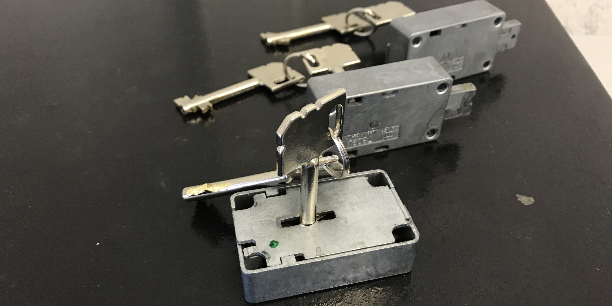
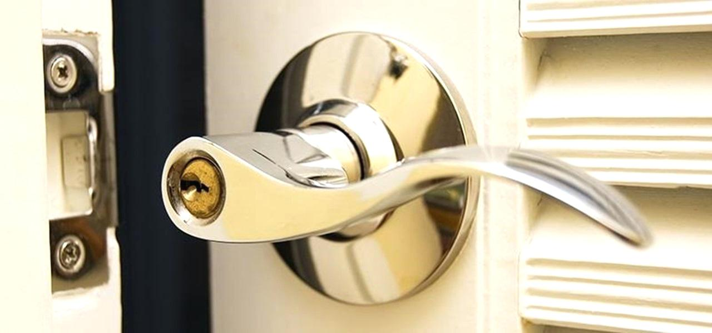
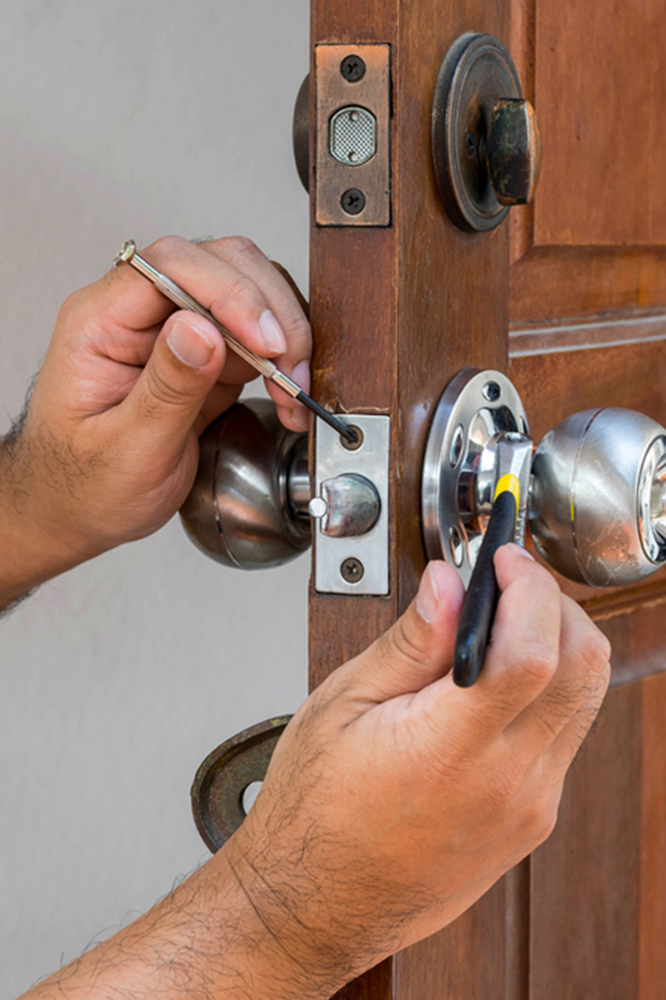

Застрял замок Torex? Нужна срочная помощь по вскрытию или установке замка Torex в Санкт-Петербурге?  Наша компания предлагает профессиональные услуги по **вскрытию и установке замков Torex**, даже если они кажутся безнадежно заклинившими.  Замки Torex, известные своей надежностью, иногда все же нуждаются в ремонте или замене.

Наши опытные мастера оперативно прибудут к вам, аккуратно **откроют заклинивший замок Torex** и, при необходимости, профессионально **установят новый замок**. Вы можете выбрать идентичный замок Torex или любой другой, соответствующий вашим требованиям и бюджету.



**Когда необходимы услуги по вскрытию и замене замков?**  Причин может быть множество: потеря или поломка ключей, кража, неисправность замка входной двери, износ механизма.  Также **замена замка Torex** может потребоваться и в межкомнатной двери для повышения безопасности или обновления интерьера.



Наши мастера работают в любой точке Санкт-Петербурга: в квартирах, частных домах, офисах, торговых центрах, складах, гаражах и других помещениях.  Мы гарантируем **аккуратное вскрытие и установку замков Torex без повреждения вашего имущества**.  Мы работаем со всеми типами замков Torex: накладными, врезными, электронными и кодовыми.

### Аварийное вскрытие замков Torex в СПб

Технология **вскрытия замка Torex** зависит от его типа и конструкции. Наши специалисты обладают необходимыми знаниями и инструментами для быстрого и эффективного решения проблемы.



Сувальдные замки Torex отличаются высокой степенью защиты.  Они состоят из набора пластин (сувальд) со специальными вырезами, которые приводятся в движение ключом с соответствующими зазубринами.  Для вскрытия сувальдного замка может потребоваться использование специальных инструментов, таких как наборной ключ или декодер.

Для каждой модели замка Torex наши мастера подберут оптимальный метод вскрытия.  В крайних случаях, когда другие методы не дают результата (например, при сильном повреждении замка), может потребоваться высверливание отдельных элементов замка: хвостовика, засова или ригелей. Мы минимизируем ущерб!

### Профессиональная установка замков Torex

**Установка замка Torex** – ответственный процесс, требующий профессионального подхода, опыта работы с современными дверными конструкциями и знания устройства различных типов замков.

При **установке замка на входную дверь** особенно важна надежность и взломостойкость механизма.  Для межкомнатных дверей важны не только надежность, но и эстетическая привлекательность замка, его соответствие интерьеру.

Наши опытные специалисты выполнят все необходимые работы по **установке замка Torex быстро, качественно и с гарантией!** Звоните прямо сейчас!