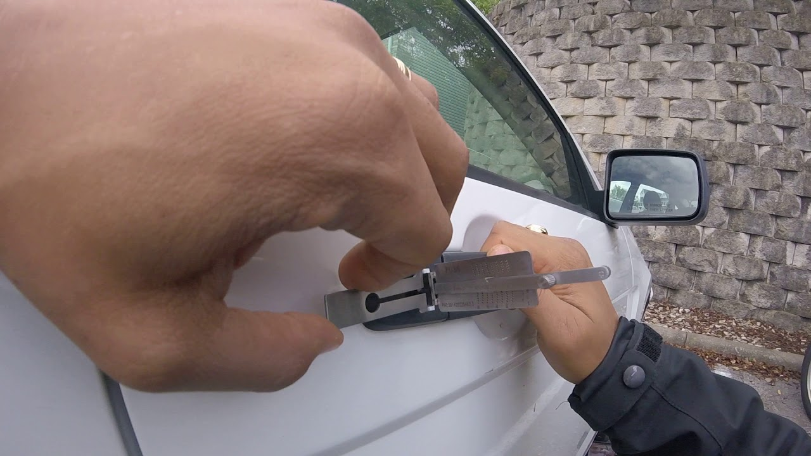

Автомобиль марки Audi может потребоваться открыть по разным причинам, будь то севший аккумулятор, неисправность электроники или механики, заклинившая дверь, багажник или капот, а может и просто забытые ключи. 





Тем не менее, нашим специалистам по силам любое подобное препятствие. Машина будет открыта без повреждений, или битья стекол, без царапин или вмятин. Вы сможете сразу же сесть за руль и уехать.

Наши мастера владеют специальными инструментами и имеют навыки, полученные в результате многолетней практики, поэтому рекомендуем доверить работу с вашей машиной, нашим профессионалам. Не пытайтесь вскрыть её сами, а вызовите мастера. Это сэкономит Вам время и деньги.

Audi — немецкая автомобилестроительная компания в составе концерна Volkswagen Group, специализирующаяся на выпуске автомобилей под маркой Audi. Штаб-квартира расположена в городе Ингольштадт (Германия). 

Девиз — Vorsprung durch Technik (с нем. — «Прогресс через технологии»). Объём производства в 2016 году составил около 1 903 259 автомобилей. В 2012 г. немецкие специалисты по автомобилям сделали рейтинг лучших подержанных авто. Авто марки Audi признали лучшими среди подержанных авто.



Большой опыт нашей компании позволяет специалистам по вскрытию замков найти подход к любому автомобилю. Мы произведем аккуратное и быстрое вскрытие независимо от брэнда производителя. 

Никаких разбитых стекол, царапин или повреждений! Вскрытие автомобиля – дело обычно срочное. Позвоните в нашу организацию, мастер произведет аварийное открывание на месте, за несколько минут, разблокирует и освободит заклинивший механизм.