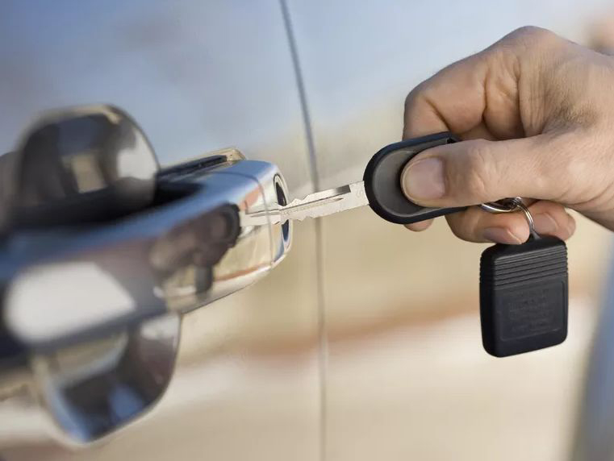

Автомобиль марки Daewoo может потребоваться открыть по разным причинам, будь то севший аккумулятор, неисправность электроники или механики, заклинившая дверь, багажник или капот, а может и просто забытые ключи. 





Тем не менее, нашим специалистам по силам любое подобное препятствие. Машина будет открыта без повреждений, или битья стекол, без царапин или вмятин. Вы сможете сразу же сесть за руль и уехать.

Наши мастера владеют специальными инструментами и имеют навыки, полученные в результате многолетней практики, поэтому рекомендуем доверить работу с вашей машиной, нашим профессионалам. Не пытайтесь вскрыть её сами, а вызовите мастера. Это сэкономит Вам время и деньги.

Daewoo — один из крупнейших южнокорейских чеболей (финансово-промышленных групп). Компания основана 22 марта 1967 года под названием Daewoo Industrial. В 1999 году ликвидирована правительством Южной Кореи, но отдельные подразделения продолжили работать как обособленные предприятия, вошедшие в состав концерна General Motors. 

В 1992 году узбекские компании «Узавтосаноат» и UzDaewooAuto создали компанию «УзДэу» для производства легковых автомобилей. В 2005 году «УзДэу авто» выкупило долю корейской компании в производстве в Узбекистане. В 2015 году на конвейере «УзДэу авто» началась замена Daewoo Nexia на новую модель Ravon Nexia. 



Большой опыт нашей компании позволяет специалистам по вскрытию замков найти подход к любому автомобилю. Мы произведем аккуратное и быстрое вскрытие независимо от брэнда производителя. Никаких разбитых стекол, царапин или повреждений! Вскрытие автомобиля – дело обычно срочное. 

Позвоните в нашу организацию, мастер произведет аварийное открывание на месте, за несколько минут, разблокирует и освободит заклинивший механизм.