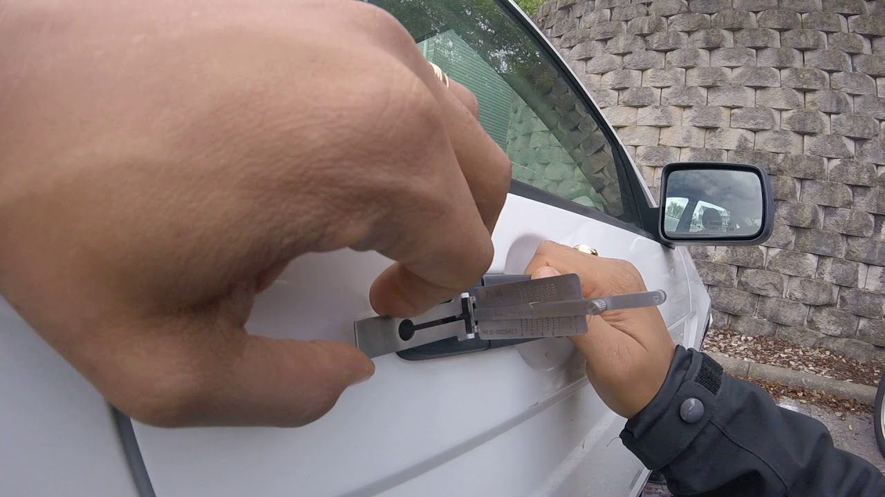

Автомобиль марки Nio может оказаться запертым по разным причинам, будь то разряженный аккумулятор, неисправность электроники или механики, защемленные двери, багажник или капот, а также утраченные ключи.





Наши специалисты могут справиться с любой подобной проблемой. Ваш автомобиль будет открыт без повреждений, не будет повреждено стекло, не появятся царапины или вмятины. Вы сможете сразу же вернуться к вождению.

Наша команда обладает специальными инструментами и обширным опытом, что позволяет нам рекомендовать вам доверить работу с вашим автомобилем нашим профессионалам. Не стоит пытаться открыть его самостоятельно, лучше вызовите нашу команду. Это сэкономит ваше время и деньги.

Nio – китайский производитель автомобилей премиум-класса. Компания была основана 24 июня 2014 года.

Nio с самого начала активно участвует в автогонках и заслужила репутацию надежного производителя спортивных автомобилей.



Благодаря нашему богатому опыту мы можем подходить к вопросу вскрытия замков автомобилей любых марок. Мы гарантируем аккуратное и оперативное вскрытие без ущерба для вашего автомобиля.

Вскрытие автомобиля – это обычно срочная необходимость. Позвоните в нашу компанию, и наш мастер выполнит аварийное открытие на месте за несколько минут, разблокирует и освободит защемленный механизм.