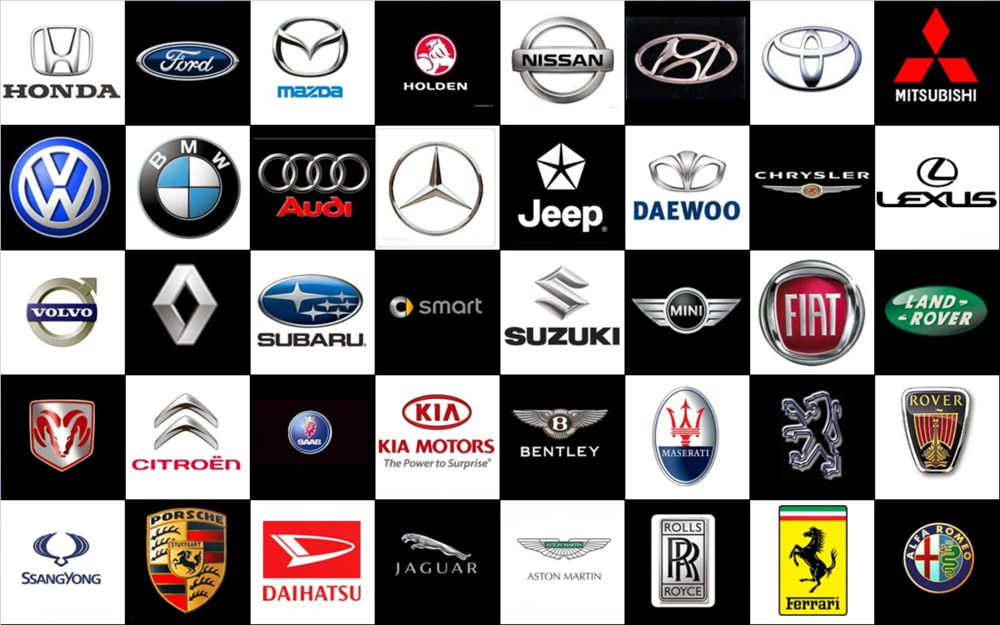
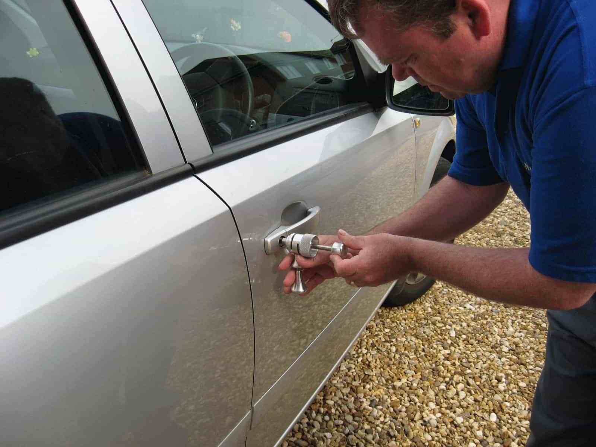

Автомобиль марки Rolls Royce может потребоваться открыть по разным причинам, будь то севший аккумулятор, неисправность электроники или механики, заклинившая дверь, багажник или капот, а может и просто забытые ключи. 





Тем не менее, нашим специалистам по силам любое подобное препятствие. Машина будет открыта без повреждений, или битья стекол, без царапин или вмятин. Вы сможете сразу же сесть за руль и уехать.

Наши мастера владеют специальными инструментами и имеют навыки, полученные в результате многолетней практики, поэтому рекомендуем доверить работу с вашей машиной, нашим профессионалам. Не пытайтесь вскрыть её сами, а вызовите мастера. Это сэкономит Вам время и деньги.

Rolls Royce — британская компания - производитель автомобилей и авиадвигателей, основанная Генри Ройсом и Чарльзом Стюартом Роллсом 15 марта 1906 года в результате их партнёрства, начавшегося в 1904 году. В 1971 году Rolls-Royce Ltd. была национализирована в результате банкротства. 

В 1973 году автомобильное подразделение было отделено от Rolls-Royce Limited под наименованием Rolls-Royce Motors. Rolls-Royce Limited продолжило работу до приватизации правительством Маргарет Тэтчер в 1987 году, став в итоге Rolls-Royce plc. 



Большой опыт нашей компании позволяет специалистам по вскрытию замков найти подход к любому автомобилю. Мы произведем аккуратное и быстрое вскрытие независимо от брэнда производителя. Никаких разбитых стекол, царапин или повреждений! Вскрытие автомобиля – дело обычно срочное. 

Позвоните в нашу организацию, мастер произведет аварийное открывание на месте, за несколько минут, разблокирует и освободит заклинивший механизм.