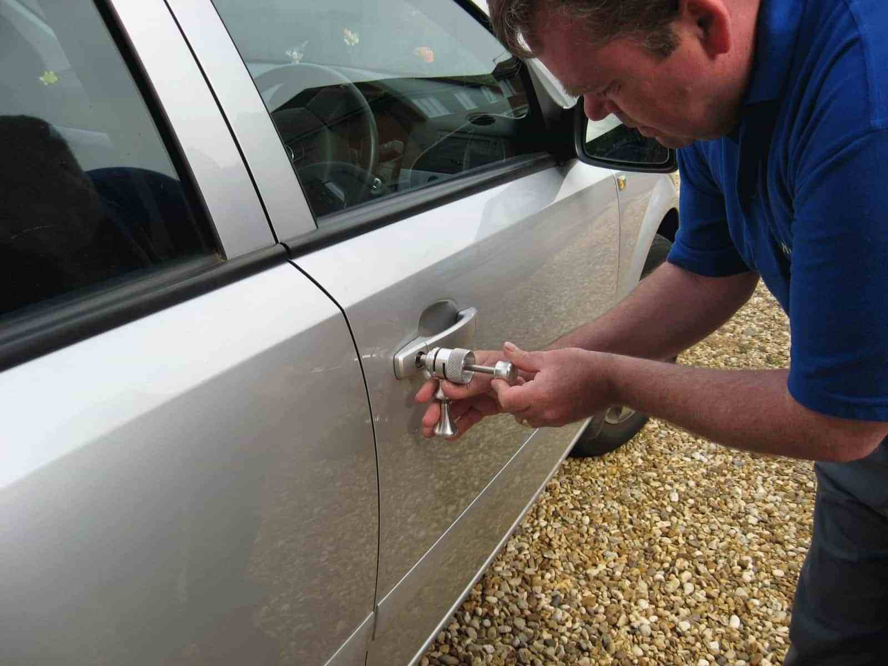
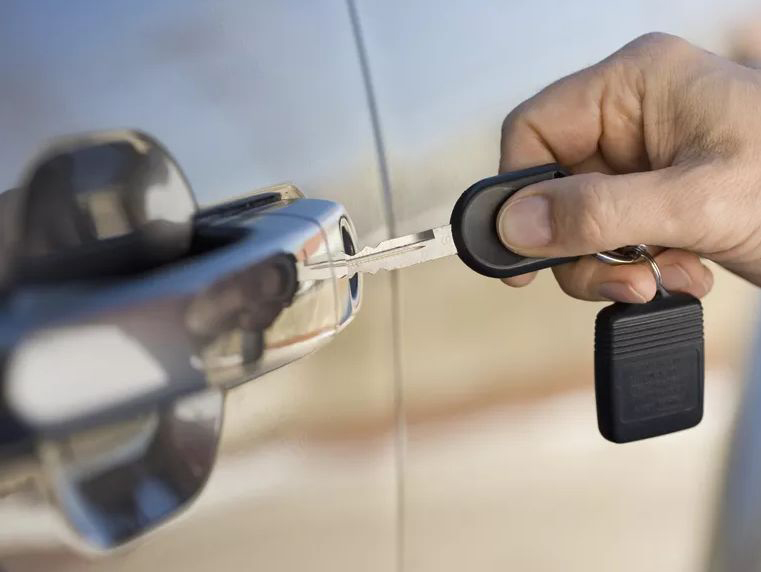

Автомобиль марки Volvo может потребоваться открыть по разным причинам, будь то севший аккумулятор, неисправность электроники или механики, заклинившая дверь, багажник или капот, а может и просто забытые ключи. Тем не менее, нашим специалистам по силам любое подобное препятствие. Машина будет открыта без повреждений, или битья стекол, без царапин или вмятин. Вы сможете сразу же сесть за руль и уехать.





Наши мастера владеют специальными инструментами и имеют навыки, полученные в результате многолетней практики, поэтому рекомендуем доверить работу с вашей машиной, нашим профессионалам. Не пытайтесь вскрыть её сами, а вызовите мастера. Это сэкономит Вам время и деньги.

Volvo — шведский концерн. Производит коммерческие и грузовые автомобили, автобусы, двигатели и различное оборудование. Ранее концерн Volvo производил также легковые автомобили, но в 1999 продал своё отделение легковых автомобилей под именем Volvo Personvagnar (Volvo Cars) концерну Ford, который в 2010 году перепродал его концерну Geely. 

Слово «Volvo» происходит из латинского языка (volvo, volvi, volutum, volvere — катать, катить, скатывать, кататься, катиться, вращать, поворачивать, крутить, кружить, крутить). Штаб-квартира — в городе Гётеборг, Швеция.



Большой опыт нашей компании позволяет специалистам по вскрытию замков найти подход к любому автомобилю. Мы произведем аккуратное и быстрое вскрытие независимо от брэнда производителя. 

Никаких разбитых стекол, царапин или повреждений! Вскрытие автомобиля – дело обычно срочное. Позвоните в нашу организацию, мастер произведет аварийное открывание на месте, за несколько минут, разблокирует и освободит заклинивший механизм.
