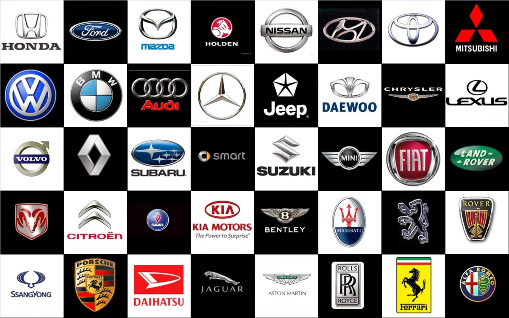

Ваш автомобиль марки Voyah может оказаться заблокированным по разным причинам, будь то разрядившийся аккумулятор, неисправность электроники или механики, залипшая дверь, багажник или капот, а также случайно забытые ключи.





Наши специалисты способны разрешить любые подобные проблемы. Ваш автомобиль будет открыт без повреждений, без разбивания стекол, не появится царапин или вмятин. Вы сможете сразу же сесть за руль и продолжить свой путь.

Наши мастера обладают специальными инструментами и обширным опытом, что гарантирует качественное выполнение работ. Мы настоятельно рекомендуем доверить обращение с вашим автомобилем нашим профессионалам. Не пытайтесь самостоятельно открыть его, лучше вызовите специалиста. Это поможет вам сэкономить время и избежать лишних расходов.

Voyah - компания, специализирующаяся на производстве автомобилей премиум-класса. Наш бренд сочетает в себе роскошь и высокие технологии, обеспечивая непревзойденный опыт вождения. 

Большой опыт наших специалистов позволяет им оперативно и эффективно справляться с задачами по вскрытию замков любых автомобилей, вне зависимости от их производителя. Мы гарантируем аккуратное и быстрое вскрытие, без повреждений, включая различные бренды автомобилей.

Вскрытие автомобиля - это часто срочная необходимость. Позвоните в нашу компанию, и наш мастер выполнит аварийное вскрытие на месте, за несколько минут, освободив залипший механизм.