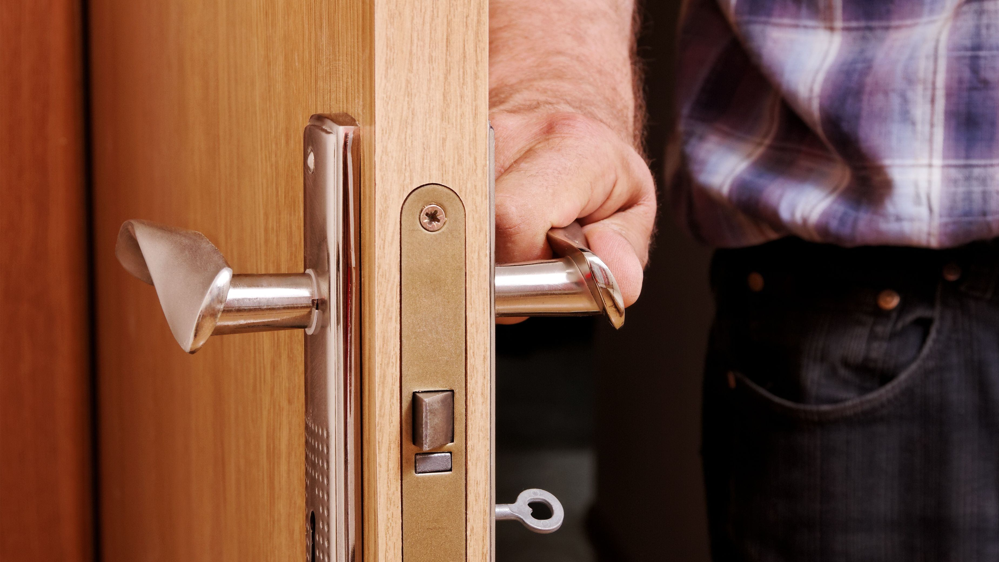
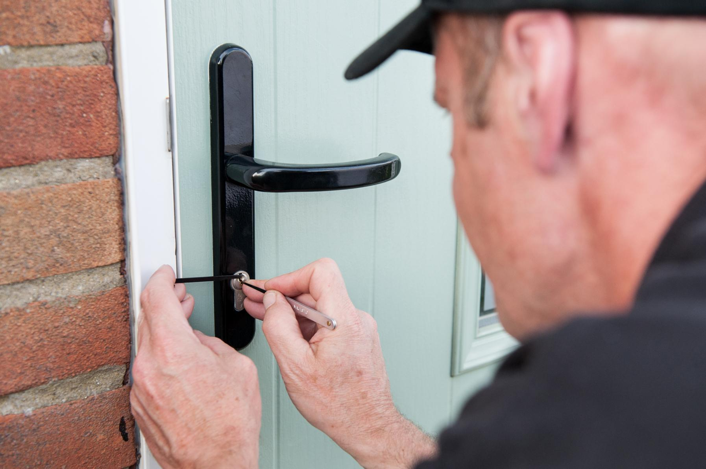
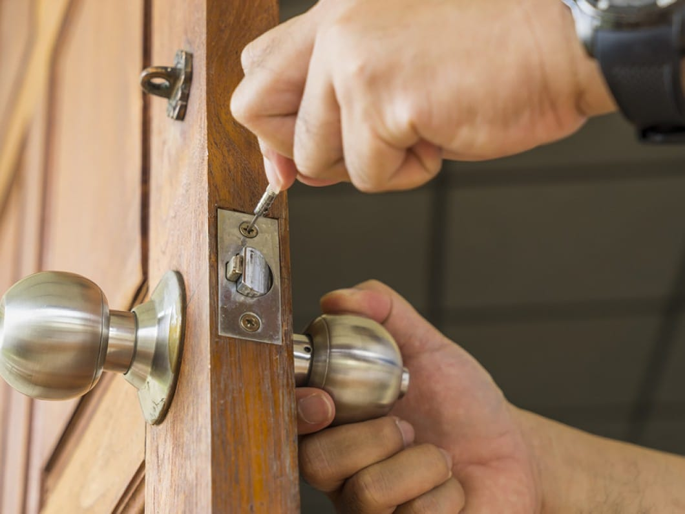
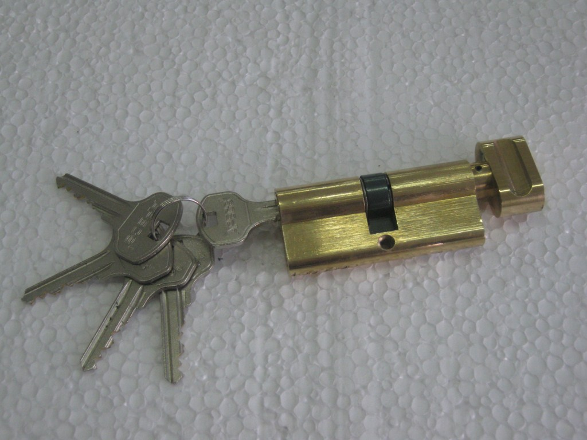
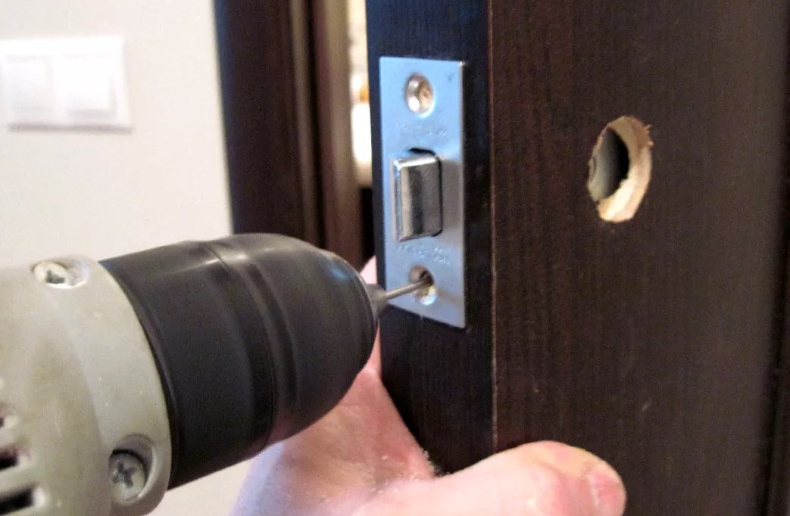
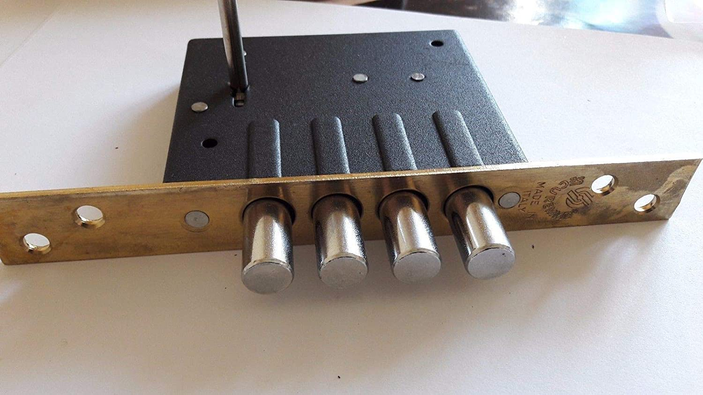



Вскрываем без повреждения двери. В случае, если есть необходимость сразу меняем замки на новые, либо часть секрета замка (цилиндры, нуклии, роторы).

Вскрываем замки дверей, гаражей, частных домов, торговых помещений, роллеты и прочее.

Устанавливаем замки на новые места.



Выполняем профессиональное вскрытие замков дверей в Санкт-Петербурге и Ленинградской области в случае их неисправности, потере ключей или в ситуации, когда просто нужно попасть в помещение, но нет ключей.



Предоставление документов на собственность, Ваше право на его использование, либо прописки во вскрываемое помещения - обязательно



Если вы потеряли ключи или сломали их в замке, замок заклинил или ключ остался в квартире и дверь захлопнулась, то мы сможем вам помочь во вскрытии замка. Вскрытие дверей выполняется в кратчайшие сроки и без повреждений  дверного полотна, так как мастер работает в основном с замком. Поэтому неважен ни производитель двери, ни её материал, ни то, что она закрывает.





Мы открываем входные, межкомнатные, балконные, гаражные и складские двери. Мастера компании Энигма работают круглосуточно и без выходных. 



В наше время не редки случаи поломки двери или замка, из-за чего открыть дверь и попасть в квартиру, гараж или в отдельную комнату становится невозможно. Для экономии времени и средств рекомендуем обратиться в нашу компанию по вскрытию замков и не предпринимать самостоятельных попыток вскрытия,  так как это может усугубить положение. Наши профессионалы обладают всем необходимым  оборудованием, а самое главное навыком работы, ведь они этим занимаются каждый день.



Наши специалисты работают в жилых домах, торговых центрах, офисах, складах, гаражах и любых других помещениях где необходимо провести вскрытие или установку замка. Установка замка и вскрытие обходится без применения грубой силы и не повредит  Ваше имущество. Наши специалисты умеют работать со всеми типами замков – накладными и врезными, электронными и кодовыми.

Также предоставляется услуга по замене замков и их ремонту. Несмотря на то, что вскрытие замка производится без повреждений, причина поломки сама по себе может потребовать ремонта замочного механизма. 

Вы можете поставить такой же замок, к которому уже привыкли  или выбрать другой. Мастер Вас проконсультирует и поможет подобрать запорное устройство для Ваших нужд. Вы сможете выбрать время замены замка, и наш специалист приедет для проведения работ в назначенный срок.

> Чтобы не попасть в трудную ситуацию и не остаться за закрытой дверью выполняйте такие нетрудные правила:
> - Старые замки необходимо заменить. Особенно если от них нет ключей
> - Выходя из квартиры берите с собой ключи
> - Не теряйте ключи. Их могут подобрать недобросовестные люди
> - Не оставляйте дома одних маленьких детей. Они могут без вас начать крутить ручки замков
> - Животные могут иногда закрыть ваш замок или щеколду своими лапами. Подумайте как можно не допустить их к замкам
> - Если ключ плохо проворачивается в замке, стоит обратить на это внимание

Если вы все таки допустили такую ситуацию и дверь закрыта, то не унывайте. Позвоните нам. Мы умеем и знаем как вам помочь максимально безопасно и без повреждений вернуться в свой дом.

### Услугу аварийного вскрытия замков в Санкт-Петербурге можно заказать вызвав мастера по телефону +7&#160;(921)&#160;940&#160;50&#160;94

На надежность двери может влиять много факторов. Кроме самого замка важна надёжность установки дверной коробки, толщина материала, наличие бронепластины, количество ригелей, и своевременное обслуживание дверного механизма. Если дверь находится в  сырости, то за сувальдным механизмом нужно регулярно следить.  Образование коррозии или напыления помешает открытию двери.

### Если заклинил замок или сломался ключ вызовите мастера по вскрытию замков позвонив по телефону +7&#160;(921)&#160;940&#160;50&#160;94

Мастер может произвести частичную разборку механизма на месте, но  если открыть дверь по-другому не получается, то возможно придется высверлить цилиндровый механизм. Если замок сложный, то мастер найдёт индивидуальный подход.

### Что делать если застрял ключ в замке двери

Иногда, в самый неожиданный момент можно столкнуться с такой неприятностью, как застрявший ключ в замке. Это может произойти с любым замком от дорогого бренда до бюджетной модели. 

#### Ключ можно попробовать извлечь самостоятельно, но лучше обратиться к специалистам во избежание поломки замка. Не стоит его пытаться вытащить с применением грубой силы. Мастер может дать Вам следующие рекомендации:

### Застрял ключ в замке двери, возможные причины

> ### Причин, по которым застрял ключ в замке двери, может быть несколько, это:
> - Поврежденный ключ. Использование ключа не по назначению (открывание бутылок, в качестве рычага или отвертки и т.д.) может привести к его деформации, что вызовет заклинивание запорного механизма.
> - Некачественно и неточно изготовленный дубликат.
> - Повышенный износ замка в результате неправильной его установки или перекос двери
> - попытка вскрытия двери отмычками
> - мусор или другие посторонние предметы внутри замка
> - ржавчина внутри замка (если замок используется на улице)

> ### Как вытащить застрявший ключ
> 1. Для начала попробуйте побрызгать спреем WD-40 или другой проникающей смазкой в замочную скважину
> 2. Попытайтесь расшевелить ключ в замке поворачивая его из стороны в сторону не применяя грубой силы и тем более не используя плоскогубцы
> 3. Если сразу не получилось, то снова ввести смазку и подождать минут 10-15 дав ей подействовать чтобы ржавчина внутри замка растворилась и освободила заклинившие части
> 4. Попробовать извлечь ключ, покачивая его из стороны в сторону, и одновременно тянуть на себя.

### Что делать если ключ сломался

А что делать, если ключ застрял в замке двери и сломался в процессе извлечения? В этом случае нужно вызывать мастера, хотя можно попробовать извлечь обломок самостоятельно и попробовать открыть дверь другим ключом.
> ### Извлечь обломок можно следующими способами:
> - Пассатижами или пинцетом при условии, что из замка торчит обломок, за который можно ухватиться
> - Мощным магнитом
> - Любым тонким предметом поддеть обломок и вытащить

Замок после такой ситуации желательно заменить для предотвращения появления этой проблемы в будущем.
