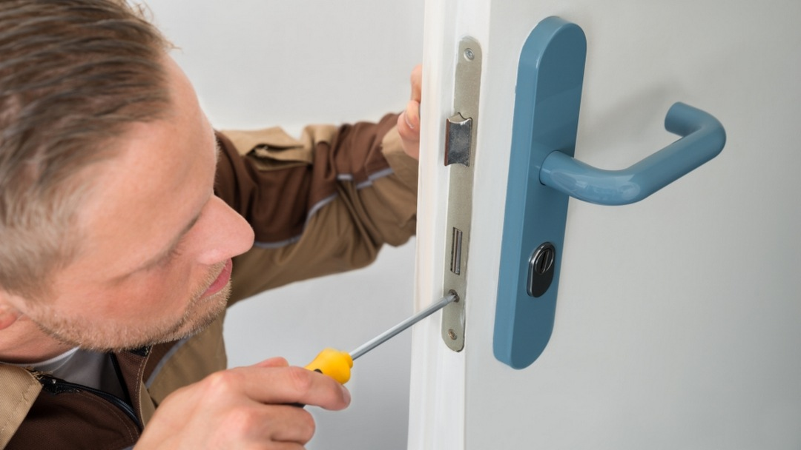
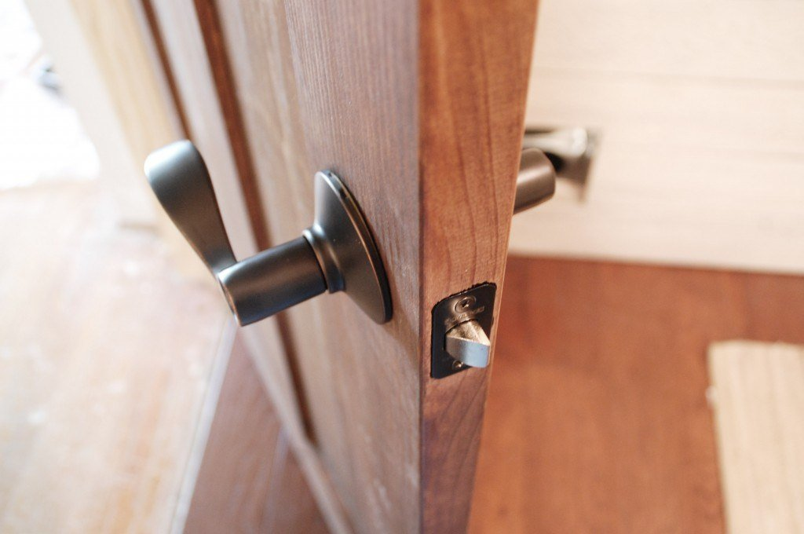

Дверь Эльбор — это не только украшение интерьера, но и средство защиты, которое будет работать хорошо только в паре с качественным замком.



Несмотря на то, что большая часть затруднений возникает именно при заклинивании замка, на открытие двери может ещё повлиять неправильная установка дверной коробки, коррозия петель, повреждение ригелей, несвоевременное обслуживание двери, если она установлена в сырости.



Наша компания производит вскрытие дверей Эльбор, вне зависимости от того, что они закрывают: входные, межкомнатные, гаражные, балконные, складские, двери холодильных камер и другие. 

Дверь будет открыта нашими мастерами без повреждений дверного полотна. 

После произведенных работ вы можете заказать установку нового замка, идентичного тому, который у Вас сейчас и к которому Вы привыкли, либо выбрать новый.

Вскрытие замков в дверях Эльбор для наших мастеров — обычное дело. 

Гигантский опыт, накопленный за долгие годы работы на рынке взлома и вскрытия дверей и замков, позволяет без труда решать поставленные заказчиком задачи и находить индивидуальный подход к сложным механизмам и ситуациям, мешающим попасть к имуществу за дверью. 

У наших мастеров есть всё необходимое оборудование и навык работы с ним. Обратитесь к нам, и мы решим Вашу проблему.
