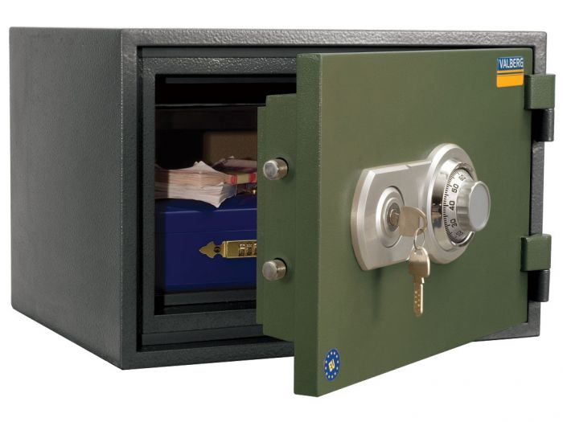
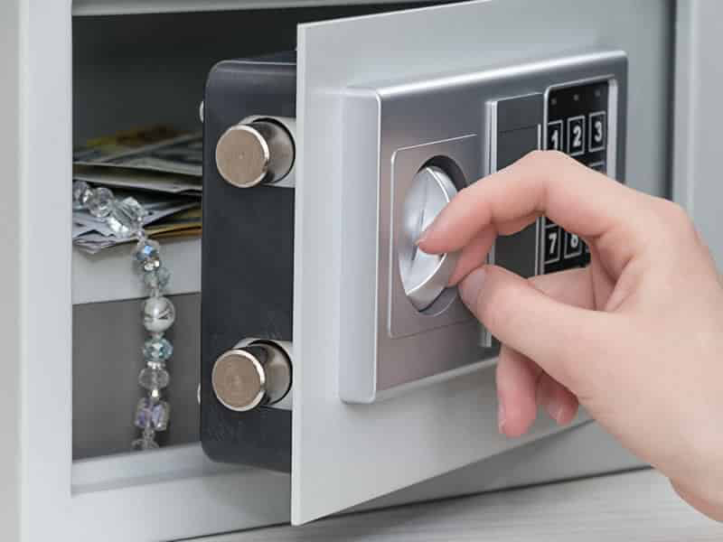
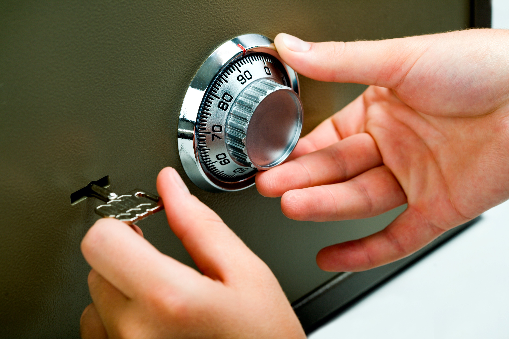







Оказываем услуги по профессиональному аварийному вскрытию сейфов в Санкт-Петербурге (СПб) и Ленинградской области. Если вы потеряли ключи от сейфа, забыли кодовую комбинацию, столкнулись с неисправностью замка или сломали ключ, наши опытные мастера выполнят вскрытие сейфа без повреждения содержимого. Предлагаем изготовление ключей для сейфов и перекодировку замков. Гарантируем конфиденциальность и аккуратность.



Вскрытие сейфа – задача, требующая специальных навыков и оборудования. Защитные механизмы сейфов значительно сложнее, чем у обычных дверей. Не пытайтесь вскрыть сейф самостоятельно, чтобы не усугубить ситуацию.



Если вы не можете открыть сейф из-за поломки замка или заклинившего механизма, обратитесь к нашим специалистам по вскрытию сейфов. Не тратьте время и силы на самостоятельные попытки – доверьте решение проблемы профессионалам. Позвоните в компанию "Энигма", и мы оперативно предоставим необходимую помощь.



Причины для вскрытия сейфа могут быть разными: забытый код, потерянные ключи, сломанный ключ в замке и т.д. В любом случае, доступ к важным документам или ценностям может быть затруднен. Вызов квалифицированного мастера по вскрытию сейфов – оптимальное решение. Наш специалист обладает необходимыми знаниями и опытом для вскрытия сейфа без повреждений, определяя причины неисправности и применяя соответствующие методы.



Каждый сейф уникален, и процесс вскрытия требует индивидуального подхода. Сейфы сконструированы для надежной защиты содержимого, и только опытный специалист знает, как правильно обращаться с такими сложными механизмами. Благодаря глубоким знаниям и навыкам, мастера компании "Энигма" выполнят вскрытие сейфа быстро, аккуратно и с гарантией сохранности содержимого.



Важно помнить, что самостоятельные попытки вскрытия сейфа могут привести к серьезным повреждениям замка и усложнить дальнейшую работу специалиста. Без специального оборудования и навыков вскрыть сейф практически невозможно.

### Нужна помощь, чтобы открыть сейф после утери ключей или поломки замка? Звоните мастеру: +7&#160;(921)&#160;940&#160;50&#160;94

Сейфы – не проблема для нашей компании по вскрытию замков. Мы профессионально справляемся с заклинившими механизмами сейфов, будь то дверь или замок. Вскрытие осуществляется быстро и без повреждений. Свяжитесь с нашими мастерами для срочного вскрытия замка. Мы работаем с частными и юридическими лицами, вскрывая сейфы любого типа: огнестойкие, взломостойкие, встраиваемые, кассовые, мебельные, гостиничные, оружейные и депозитные.

Наши мастера обладают обширным опытом работы с кодовыми и электронно-кодовыми замками, как старых, так и новых моделей, включая системы безопасности M-LOCKS и Cisa. Мы оперативно и профессионально выполним вскрытие замка без следов взлома и повреждений.

Сейфовые замки классифицируются по классу взломостойкости и типу: сувальдные (ключевые), кодовые (механические, использующие комбинации цифр, букв или знаков) и электронные (с использованием магнитных или бесконтактных ключей, а также биометрических систем аутентификации).

### Требуется вскрытие сейфа без ключа или кода? Обращайтесь! Вызовите мастера по телефону +7&#160;(921)&#160;940&#160;50&#160;94

Современные сейфы часто оснащаются несколькими типами замков для повышенной надежности и защиты от взлома. Наши мастера успешно справляются с любыми типами замков при неисправности сейфа.
